# AegisRAG End-to-End User Journey

**Version:** 1.0
**Date:** 2026-01-03
**Status:** Strategic Planning

---

## Übergeordnete User Journey

### Complete Workflow: Domain → Chat → Research → Tools

```mermaid
graph TD
    A[1. Domain definieren] --> B[2. Domain Training]
    B --> C[3. Dokumente importieren]
    C --> D[4. Chat Quality Testing]
    D --> E{Qualität OK?}
    E -->|Nein| F[Retrieval-Methode anpassen]
    F --> D
    E -->|Ja| G[5. Deep Research]
    G --> H[6. Chat + Tool Use]
    H --> I[7. RAGAS Benchmark]
```



---

## Journey Steps - Detailliert

### 1. Domain definieren 📋

**Zweck:** Spezialisiertes Wissen für spezifische Fachbereiche aufbauen

**User Actions:**
- Admin UI: `/admin/domain-training` öffnen
- Domain Name eingeben (z.B. "Machine Learning", "Enterprise Architecture")
- Domain Description eingeben
- Domain speichern

**System:**
- Domain ID erstellen
- Isolierte Knowledge Base in Qdrant/Neo4j anlegen
- Domain-spezifische Embeddings vorbereiten

**E2E Test Coverage:**
- ✅ Sprint 73: Domain Training UI Tests (Feature 73.6)
  - `admin-domain-training.spec.ts`: Create, edit, delete domains
  - Coverage: UI + API integration

**Gap:**
- ⚠️ Fehlende Tests: Domain-isolierte Retrieval-Verifikation
- ⚠️ Fehlende Tests: Multi-Domain-Context (verschiedene Domains gleichzeitig)

---

### 2. Domain Training 🎓

**Zweck:** Beispiele für hochwertige Antworten in dieser Domain bereitstellen

**User Actions:**
- Training Examples hinzufügen (Frage + erwartete Antwort)
- RAG Settings anpassen:
  - Retrieval Methode: BM25, Vector, Hybrid, Graph
  - Reranker Weights
  - Context Window
- Training starten

**System:**
- Beispiele in Domain Knowledge Base speichern
- Reranker lernt aus Beispielen (Feature 69.3)
- Query Rewriter passt sich an (Feature 69.4)

**E2E Test Coverage:**
- ✅ Sprint 73: Domain Training Tests (Feature 73.6)
  - Training examples CRUD
  - Settings UI
- ✅ Sprint 69: Learned Reranker Weights
  - `/dashboard/costs` zeigt gelernte Weights

**Gap:**
- ⚠️ Fehlende Tests: Training-Beispiele → bessere Retrieval-Qualität
- ⚠️ Fehlende Tests: A/B Test (mit/ohne Training)

---

### 3. Dokumente importieren 📄

**Zweck:** Knowledge Base mit Inhalten füllen

**User Actions:**
- Admin UI: `/admin` → Indexing Tab
- Dokumente hochladen (PDF, DOCX, etc.)
- Domain zuweisen
- VLM Metadata Option wählen
- Upload starten

**System:**
- Docling CUDA: OCR + Parsing (ADR-027)
- Section-aware Chunking (ADR-039)
- BGE-M3 Embeddings (ADR-024)
- Qdrant: Vector Storage
- Neo4j: Entity/Relation Extraction
- Graphiti: Memory Layer

**E2E Test Coverage:**
- ✅ Sprint 73: Document Upload Tests (Feature 73.5)
  - `admin-indexing.spec.ts`: Upload, cancel, VLM metadata
- ✅ Sprint 66: Document Upload Pipeline
  - Full ingestion flow tested

**Gap:**
- ⚠️ Fehlende Tests: Dokument → Retrieval (upload + sofort abrufbar?)
- ⚠️ Fehlende Tests: Große Dateien (100+ Seiten)
- ⚠️ Fehlende Tests: Batch Upload (10+ Dokumente gleichzeitig)

---

### 4. Chat Quality Testing 💬

**Zweck:** Testen ob die Antworten qualitativ passen

**User Actions:**
- Chat öffnen: `/`
- Fragen stellen
- Antwort-Qualität bewerten:
  - ✅ Korrekt beantwortet?
  - ✅ Relevante Quellen zitiert?
  - ✅ Kontext aus vorherigen Turns genutzt?
- Retrieval-Methode in Settings ändern:
  - BM25 (keyword search)
  - Vector (semantic search)
  - Hybrid (BM25 + Vector + RRF)
  - Local Graph (entity-based)
  - Global Graph (community-based)

**System:**
- Coordinator Agent: Query Routing (ADR-040)
- Vector Agent: Qdrant Hybrid Search
- Graph Agent: Neo4j Reasoning
- Memory Agent: Graphiti Temporal Memory
- Response Generation mit Citations

**E2E Test Coverage:**
- ✅ Sprint 73: Chat Interface Tests (Feature 73.2)
  - `chat-interface.spec.ts`: Send message, citations, settings
- ✅ Sprint 73: Multi-Turn Tests (Feature 73.3)
  - `chat-multi-turn.spec.ts`: Context preservation (7 tests)
- ⚠️ **Aktuell:** Integration Tests zeigen LLM funktioniert, aber Timeouts

**Gap:**
- ❌ **KRITISCH:** Keine Tests für verschiedene Retrieval-Methoden
  - Kein Test: BM25 vs Vector vs Hybrid
  - Kein Test: Local Graph vs Global Graph
  - Kein Test: Welche Methode für welche Frage?
- ❌ **KRITISCH:** Keine automatische Qualitäts-Bewertung
  - Antwort-Relevanz?
  - Citation-Accuracy?
  - Kontext-Nutzung?

---

### 5. Deep Research 🔍

**Zweck:** Multi-Step Research mit eigenen Dokumenten + externe Tools

**User Actions:**
- Chat: Research-Mode aktivieren (`🔬 Research` Toggle)
- Research-Frage stellen (z.B. "Compare ML approaches in my documents with current best practices")
- Warten auf Multi-Step Research:
  1. Query Decomposition
  2. Sub-Query Retrieval (eigene Docs)
  3. External Tool Calls (Web Search, etc.)
  4. Synthesis

**System:**
- Research Agent (LangGraph)
- Multi-Document Retrieval
- Tool Orchestration (MCP Framework)
- Iterative Refinement

**E2E Test Coverage:**
- ⚠️ Sprint 73: Partial Coverage
  - `chat-interface.spec.ts` hat Research Toggle
  - ABER: Kein Test der Research-Pipeline
- ❌ **Fehlend:** Research Agent Tests

**Gap:**
- ❌ **KRITISCH:** Keine E2E Tests für Deep Research
- ❌ Keine Tests für Multi-Step Workflows
- ❌ Keine Tests für Query Decomposition

---

### 6. Chat + Tool Use 🛠️

**Zweck:** LLM kann Tools/Funktionen aufrufen (MCP)

**User Actions:**
- Chat: Fragen die Tool-Use erfordern
  - "What's the weather in Munich?" → Weather API
  - "Execute this Python code: print(2+2)" → Code Execution Tool
  - "Search the web for latest AI news" → Web Search Tool

**System:**
- Action Agent (Sprint 59: Tool Framework)
- MCP Server Integration
- Secure Shell Sandbox (Sprint 67: deepagents)
- Tool Call → Execution → Result Integration

**E2E Test Coverage:**
- ⚠️ Sprint 67: Shell Sandbox (secure execution)
- ❌ **Fehlend:** Keine E2E Tests für Tool Use

**Gap:**
- ❌ **KRITISCH:** Keine Tool-Use Tests im Frontend
- ❌ Keine Tests für verschiedene Tool-Typen
- ❌ Keine Tests für Tool-Error-Handling

---

### 7. RAGAS Benchmark 📊

**Zweck:** Objektive Qualitäts-Metriken mit Industrie-Standard

**Konzept:**
- RAGAS (RAG Assessment) = Framework für RAG System Evaluation
- Metriken:
  - **Context Precision:** Relevanz der abgerufenen Dokumente
  - **Context Recall:** Vollständigkeit (alle relevanten Docs abgerufen?)
  - **Faithfulness:** Antwort basiert auf abgerufenen Docs (keine Halluzination)
  - **Answer Relevancy:** Antwort beantwortet die Frage

**Implementation Plan:**

#### 7.1 RAGAS Dataset als User Journeys

```python
# Beispiel RAGAS Test Case
{
  "question": "What is the capital of France?",
  "ground_truth": "Paris",
  "context": ["France is a country... Paris is the capital..."],
  "answer": "The capital of France is Paris.",
  "scores": {
    "context_precision": 0.95,
    "context_recall": 1.0,
    "faithfulness": 1.0,
    "answer_relevancy": 0.98
  }
}
```

**User Journey Integration:**

1. **Prepare RAGAS Dataset:**
   - Eigene Domain-spezifische Fragen erstellen
   - Ground Truth Antworten definieren
   - Expected Context Dokumente markieren

2. **Run RAGAS Tests:**
   ```bash
   pytest tests/ragas/test_ragas_benchmark.py
   ```

3. **E2E Test Integration:**
   ```typescript
   // frontend/e2e/tests/ragas/ragas-benchmark.spec.ts
   test('RAGAS: Context Precision', async ({ page }) => {
     // Load RAGAS test case
     const testCase = ragasDataset[0];

     // Send question
     await chatPage.sendMessage(testCase.question);

     // Get response + citations
     const response = await chatPage.getLastResponse();
     const citations = await chatPage.getCitations();

     // Verify Context Precision
     const precision = calculateContextPrecision(citations, testCase.context);
     expect(precision).toBeGreaterThan(0.8); // 80% threshold

     // Verify Answer Relevancy
     const relevancy = await evaluateAnswerRelevancy(response, testCase.ground_truth);
     expect(relevancy).toBeGreaterThan(0.8);
   });
   ```

**E2E Test Coverage:**
- ❌ **Fehlend:** Keine RAGAS Integration

**Gap:**
- ❌ **KRITISCH:** Keine objektive Qualitäts-Messung
- ❌ Keine Regression Tests (Performance verschlechtert sich?)
- ❌ Keine Vergleichbarkeit mit anderen RAG Systemen

---

## Gap Analysis Summary

### Current Test Coverage (Sprint 73)

| Journey Step | UI Tests | Integration Tests | RAGAS | Status |
|--------------|----------|-------------------|-------|--------|
| 1. Domain definieren | ✅ 100% | ✅ 100% | ❌ | 🟢 Ready |
| 2. Domain Training | ✅ 100% | ⚠️ 50% | ❌ | 🟡 Partial |
| 3. Dokumente importieren | ✅ 100% | ✅ 90% | ❌ | 🟢 Ready |
| 4. Chat Quality Testing | ✅ 80% | ⚠️ 40% | ❌ | 🟡 Partial |
| 5. Deep Research | ⚠️ 20% | ❌ 0% | ❌ | 🔴 Missing |
| 6. Chat + Tool Use | ❌ 0% | ❌ 0% | ❌ | 🔴 Missing |
| 7. RAGAS Benchmark | ❌ 0% | ❌ 0% | ❌ | 🔴 Missing |

### Critical Gaps

#### Priority 1 (Sprint 74) 🔥

1. **Retrieval Method Comparison Tests**
   - Test: BM25 vs Vector vs Hybrid für gleiche Frage
   - Test: Local Graph vs Global Graph
   - Metric: Welche Methode liefert beste Results?

2. **Fix Integration Test Timeouts**
   - Update: 60s → 180s timeout
   - Update: Language-agnostic assertions
   - Verify: All 7 multi-turn tests pass

3. **RAGAS Foundation Setup**
   - Install: `pip install ragas`
   - Create: `tests/ragas/` directory
   - Define: First 10 RAGAS test cases (domain-specific)

#### Priority 2 (Sprint 75) 🎯

4. **Deep Research E2E Tests**
   - Test: Multi-step research workflow
   - Test: Query decomposition
   - Test: External tool calls

5. **Tool Use E2E Tests**
   - Test: Weather API call
   - Test: Code execution (sandbox)
   - Test: Web search integration

6. **RAGAS Full Integration**
   - Implement: Context Precision/Recall tests
   - Implement: Faithfulness tests
   - Implement: Answer Relevancy tests
   - Dashboard: RAGAS scores visualization

#### Priority 3 (Sprint 76+) 🚀

7. **Performance Benchmarks**
   - Test: Response time per retrieval method
   - Test: Scaling (100, 1000, 10000 documents)
   - Test: Concurrent users (10, 50, 100)

8. **Multi-Domain E2E Tests**
   - Test: Switch between domains
   - Test: Domain isolation (keine cross-domain leaks)
   - Test: Domain-spezifische Reranker

---

## RAGAS Implementation Example

### Step 1: RAGAS Dataset Definition

```python
# tests/ragas/datasets/machine_learning_dataset.py

from ragas.testset.generator import TestsetGenerator
from ragas.testset.evolutions import simple, reasoning, multi_context

# Our documents (already in Qdrant/Neo4j)
documents = [
    "Machine learning is a subset of AI...",
    "Neural networks consist of layers...",
    # ... more documents
]

# Generate RAGAS test cases
generator = TestsetGenerator.with_openai()

testset = generator.generate_with_langchain_docs(
    documents,
    test_size=50,  # 50 test cases
    distributions={
        simple: 0.5,      # 50% simple questions
        reasoning: 0.25,  # 25% reasoning questions
        multi_context: 0.25  # 25% multi-context questions
    }
)

testset.to_pandas().to_csv("ragas_ml_testset.csv")
```

### Step 2: RAGAS Evaluation

```python
# tests/ragas/test_ragas_evaluation.py

from ragas import evaluate
from ragas.metrics import (
    context_precision,
    context_recall,
    faithfulness,
    answer_relevancy
)

def test_aegis_rag_ragas_benchmark():
    # Load our test cases
    testset = pd.read_csv("ragas_ml_testset.csv")

    # Run AegisRAG on each test case
    results = []
    for _, row in testset.iterrows():
        question = row['question']
        ground_truth = row['ground_truth']

        # Call AegisRAG API
        response = aegis_rag_client.chat(question, domain="machine_learning")

        results.append({
            "question": question,
            "answer": response.answer,
            "contexts": response.sources,  # Retrieved documents
            "ground_truth": ground_truth
        })

    # Evaluate with RAGAS
    scores = evaluate(
        Dataset.from_list(results),
        metrics=[
            context_precision,
            context_recall,
            faithfulness,
            answer_relevancy
        ]
    )

    # Assert quality thresholds
    assert scores['context_precision'] > 0.80, "Context Precision below 80%"
    assert scores['context_recall'] > 0.75, "Context Recall below 75%"
    assert scores['faithfulness'] > 0.90, "Faithfulness below 90%"
    assert scores['answer_relevancy'] > 0.85, "Answer Relevancy below 85%"

    return scores
```

### Step 3: E2E Test Integration

```typescript
// frontend/e2e/tests/ragas/ragas-e2e.spec.ts

import { test, expect } from '../../fixtures';
import { ragasTestCases } from './ragas-testcases.json';

test.describe('RAGAS E2E Benchmark', () => {
  test('should achieve >80% context precision across all test cases', async ({ chatPage }) => {
    const results = [];

    for (const testCase of ragasTestCases) {
      // Send question
      await chatPage.sendMessage(testCase.question);

      // Get response + citations
      const response = await chatPage.getLastResponse();
      const citations = await chatPage.getCitations();

      // Calculate metrics
      const precision = calculateContextPrecision(
        citations,
        testCase.expected_contexts
      );

      results.push({
        question: testCase.question,
        precision: precision,
        passed: precision > 0.80
      });
    }

    // Overall metric
    const avgPrecision = results.reduce((sum, r) => sum + r.precision, 0) / results.length;

    // Assert
    expect(avgPrecision).toBeGreaterThan(0.80);

    // Log failures
    const failures = results.filter(r => !r.passed);
    if (failures.length > 0) {
      console.log(`Failed cases (${failures.length}):`, failures);
    }
  });
});
```

---

## Recommended Roadmap

### Sprint 74: Quality & Benchmarks (34 SP)

**Focus:** Fix integration tests + RAGAS foundation

1. **Fix Integration Tests (8 SP)**
   - Update timeouts (60s → 180s)
   - Language-agnostic assertions
   - Verify all 7 tests pass
   - Document LLM performance baselines

2. **Retrieval Method Comparison Tests (13 SP)**
   - E2E Test: BM25 vs Vector vs Hybrid (5 SP)
   - E2E Test: Local Graph vs Global Graph (5 SP)
   - Metrics Dashboard (3 SP)

3. **RAGAS Foundation (13 SP)**
   - Install RAGAS framework (2 SP)
   - Create 20 domain-specific test cases (5 SP)
   - Implement Context Precision/Recall tests (6 SP)

### Sprint 75: Research & Tools (34 SP)

**Focus:** Deep Research + Tool Use

1. **Deep Research E2E Tests (13 SP)**
   - Research workflow test (5 SP)
   - Query decomposition test (4 SP)
   - Multi-document synthesis test (4 SP)

2. **Tool Use E2E Tests (13 SP)**
   - Weather API test (3 SP)
   - Code execution test (5 SP)
   - Web search test (3 SP)
   - Error handling (2 SP)

3. **RAGAS Full Integration (8 SP)**
   - Faithfulness tests (3 SP)
   - Answer Relevancy tests (3 SP)
   - Dashboard visualization (2 SP)

### Sprint 76: Performance & Scale (34 SP)

**Focus:** Performance benchmarks + Production readiness

1. **Performance Benchmarks (13 SP)**
   - Response time benchmarks (5 SP)
   - Document scaling tests (5 SP)
   - Concurrent user tests (3 SP)

2. **Multi-Domain Tests (8 SP)**
   - Domain switching (3 SP)
   - Domain isolation (3 SP)
   - Domain-specific reranker (2 SP)

3. **Production Monitoring (13 SP)**
   - RAGAS continuous monitoring (5 SP)
   - Performance regression alerts (5 SP)
   - Quality dashboards (3 SP)

---

## Success Metrics

### Quality Metrics (RAGAS)

| Metric | Sprint 74 Target | Sprint 75 Target | Production Target |
|--------|------------------|------------------|-------------------|
| Context Precision | 0.75 | 0.80 | 0.85 |
| Context Recall | 0.70 | 0.75 | 0.80 |
| Faithfulness | 0.85 | 0.90 | 0.95 |
| Answer Relevancy | 0.80 | 0.85 | 0.90 |

### Performance Metrics

| Metric | Current | Sprint 74 Target | Production Target |
|--------|---------|------------------|-------------------|
| Response Time (P95) | 60-120s | 40-80s | 30-60s |
| TTFT (Time to First Token) | 2-3s | 1-2s | <1s |
| Documents Indexed | ~100 | ~1,000 | ~10,000 |
| Concurrent Users | 1 | 10 | 50 |

### Test Coverage Metrics

| Category | Sprint 73 | Sprint 74 Target | Sprint 76 Target |
|----------|-----------|------------------|------------------|
| UI Tests | 98 | 110 | 130 |
| Integration Tests | 7 | 25 | 50 |
| RAGAS Tests | 0 | 20 | 50 |
| Overall Coverage | 63% | 75% | 90% |

---

## Conclusion

Die vorgeschlagene User Journey (1-7) ist **genau richtig** und deckt den kompletten Workflow ab:

✅ **Gut abgedeckt (Sprint 73):**
- Domain definieren
- Dokumente importieren
- Basis Chat Tests

⚠️ **Teilweise abgedeckt:**
- Domain Training (UI ✅, Quality Tests ❌)
- Chat Quality (Basic ✅, Retrieval Comparison ❌)

❌ **Kritische Lücken:**
- Retrieval Method Comparison (BM25 vs Vector vs Graph)
- Deep Research E2E Tests
- Tool Use E2E Tests
- **RAGAS Integration** (wichtigste Gap!)

**Nächste Schritte:**
1. Sprint 74: RAGAS Foundation + Retrieval Comparison
2. Sprint 75: Research + Tool Use
3. Sprint 76: Performance + Production Readiness

Die **RAGAS Integration** (Punkt 7) ist besonders wertvoll, weil sie objektive, vergleichbare Metriken liefert und als Regression-Test-Suite dienen kann.

---

---

## Sprint 75: RAGAS E2E User Journey Implementation

### Overview

**Sprint 75 implementiert die komplette 4-Schritt User Journey:**

```
Frontend E2E (Playwright)          Backend Script (Python)
┌──────────────────────────┐      ┌──────────────────────────┐
│ 1. Domain anlegen        │      │                          │
│ 2. Domain trainieren     │ ───► │ 4. RAGAS Evaluation      │
│ 3. Dokumente ingest      │      │    - Namespace-isoliert  │
└──────────────────────────┘      └──────────────────────────┘
     ↓
namespace_id: "ragas_eval_domain"
```

**Warum diese Architektur?**

✅ **Frontend-First Testing**: Schritte 1-3 testen den kompletten Stack (UI → API → Databases)
✅ **Namespace Isolation**: RAGAS-Docs getrennt von Production-Daten
✅ **Real User Workflow**: Genau so wie Production-User arbeiten würden
✅ **Wiederverwendbar**: Script kann für andere Domains laufen

---

### Step 1-3: Playwright E2E Test

**File:** `frontend/e2e/tests/ragas/ragas-domain-setup.spec.ts`

```typescript
import { test, expect } from '../../fixtures';

/**
 * RAGAS E2E User Journey - Part 1: Domain Setup & Document Ingestion
 *
 * Sprint 75: Frontend-driven setup for RAGAS evaluation
 *
 * This test prepares the environment for RAGAS evaluation by:
 * 1. Creating a dedicated domain (namespace_id: "ragas_eval_domain")
 * 2. Configuring optimal RAG settings (Hybrid retrieval + reranking)
 * 3. Ingesting AEGIS RAG documentation (493 .md files)
 *
 * After this test completes successfully, run the Python RAGAS script:
 *   python scripts/run_ragas_on_namespace.py --namespace ragas_eval_domain
 */

test.describe('RAGAS E2E: Domain Setup + Document Ingestion', () => {
  const NAMESPACE_ID = 'ragas_eval_domain';
  const DOCS_PATH = '/home/admin/projects/aegisrag/AEGIS_Rag/docs';

  test.beforeAll(async ({ request }) => {
    // Clean up: Delete domain if exists from previous run
    try {
      await request.delete(`/api/v1/admin/domains/${NAMESPACE_ID}`);
    } catch (e) {
      // Ignore if domain doesn't exist
    }
  });

  test('Step 1: Create RAGAS Evaluation Domain', async ({ page }) => {
    // Navigate to Domain Training page
    await page.goto('/admin/domain-training');

    // Wait for page load
    await expect(page.locator('h1:has-text("Domain Training")')).toBeVisible();

    // Click "Create Domain"
    await page.click('button:has-text("Create Domain")');

    // Fill domain details
    await page.fill('input[name="domainId"]', NAMESPACE_ID);
    await page.fill('input[name="name"]', 'RAGAS Evaluation Domain');
    await page.fill('textarea[name="description"]',
      'Domain for RAGAS evaluation with AEGIS RAG documentation. ' +
      'Namespace-isolated for objective quality measurement.'
    );

    // Save domain
    await page.click('button:has-text("Save")');

    // Wait for success notification
    await expect(page.locator('text=Domain created successfully')).toBeVisible({
      timeout: 5000
    });

    // Verify domain appears in list
    await expect(page.locator(`tr:has-text("${NAMESPACE_ID}")`)).toBeVisible();

    console.log(`✓ Step 1 complete: Domain "${NAMESPACE_ID}" created`);
  });

  test('Step 2: Configure Domain Training Settings', async ({ page }) => {
    // Navigate to Domain Training page
    await page.goto('/admin/domain-training');

    // Select our domain from the table
    await page.click(`tr:has-text("${NAMESPACE_ID}")`);

    // Wait for domain details panel
    await expect(page.locator('h2:has-text("Domain Details")')).toBeVisible();

    // Click RAG Settings tab
    await page.click('button:has-text("RAG Settings")');

    // Configure optimal settings for RAGAS evaluation
    await page.selectOption('select[name="retrievalMethod"]', 'hybrid');
    await page.check('input[name="useReranking"]');
    await page.fill('input[name="topK"]', '10');
    await page.fill('input[name="scoreThreshold"]', '0.65');

    // Advanced settings
    await page.click('text=Advanced');
    await page.check('input[name="adaptiveWeights"]');  // Enable learned weights
    await page.fill('input[name="rerfK"]', '60');       // RRF constant

    // Save settings
    await page.click('button:has-text("Save Settings")');

    // Wait for success message
    await expect(page.locator('text=Settings saved successfully')).toBeVisible({
      timeout: 5000
    });

    console.log('✓ Step 2 complete: RAG settings configured (Hybrid + Reranking)');
  });

  test('Step 3: Upload AEGIS RAG Documentation', async ({ page }) => {
    // Navigate to Admin Indexing page
    await page.goto('/admin');
    await page.click('text=Indexing');

    // Wait for indexing panel
    await expect(page.locator('h2:has-text("Document Indexing")')).toBeVisible();

    // Select our namespace
    await page.selectOption('select[name="namespace"]', NAMESPACE_ID);

    // Click "Scan Directory" tab
    await page.click('button:has-text("Scan Directory")');

    // Enter AEGIS RAG docs path
    await page.fill('input[name="directoryPath"]', DOCS_PATH);
    await page.check('input[name="recursive"]');  // Scan subdirectories

    // Click scan button
    await page.click('button:has-text("Scan")');

    // Wait for scan results
    await expect(page.locator('text=files found')).toBeVisible({
      timeout: 10000
    });

    // Verify file count (should be ~493 .md files)
    const fileCountText = await page.locator('[data-testid="scan-result-count"]').textContent();
    const fileCount = parseInt(fileCountText?.match(/\d+/)?.[0] || '0');
    expect(fileCount).toBeGreaterThan(400);  // At least 400 files

    console.log(`✓ Found ${fileCount} documentation files`);

    // Select all Markdown files
    await page.click('button:has-text("Select All .md")');

    // Verify selection count
    const selectedCount = await page.locator('[data-testid="selected-count"]').textContent();
    expect(parseInt(selectedCount || '0')).toBeGreaterThan(400);

    // Configure ingestion settings
    await page.check('input[name="enableVLM"]');  // Enable VLM metadata
    await page.check('input[name="enableGraphExtraction"]');  // Enable Neo4j

    // Start batch indexing
    await page.click('button:has-text("Start Indexing")');

    // Wait for indexing to start
    await expect(page.locator('text=Indexing in progress')).toBeVisible({
      timeout: 5000
    });

    // Wait for completion (may take 10-20 minutes for 493 documents)
    // Poll every 30 seconds
    let completed = false;
    let attempts = 0;
    const maxAttempts = 40; // 20 minutes max

    while (!completed && attempts < maxAttempts) {
      await page.waitForTimeout(30000); // 30 seconds

      // Check if completed
      const status = await page.locator('[data-testid="indexing-status"]').textContent();
      if (status?.includes('complete')) {
        completed = true;
        break;
      }

      // Log progress
      const progress = await page.locator('[data-testid="indexing-progress"]').textContent();
      console.log(`  Indexing progress: ${progress}`);

      attempts++;
    }

    if (!completed) {
      throw new Error('Indexing timeout after 20 minutes');
    }

    // Verify final document count
    const indexedCount = await page.locator('[data-testid="indexed-count"]').textContent();
    const indexed = parseInt(indexedCount || '0');

    expect(indexed).toBeGreaterThan(400); // At least 400 docs successfully indexed

    console.log(`✓ Step 3 complete: ${indexed} documents indexed to namespace "${NAMESPACE_ID}"`);

    // Verify namespace isolation
    await page.goto('/admin/namespaces');
    await page.click(`tr:has-text("${NAMESPACE_ID}")`);

    const namespaceDocCount = await page.locator('[data-testid="namespace-doc-count"]').textContent();
    expect(parseInt(namespaceDocCount || '0')).toBe(indexed);

    console.log('✓ Namespace isolation verified');
  });
});
```

---

### Step 4: RAGAS Evaluation Script

**File:** `scripts/run_ragas_on_namespace.py`

```python
#!/usr/bin/env python3
"""Run RAGAS evaluation on namespace-isolated domain.

Sprint 75: E2E User Journey - Step 4: RAGAS Evaluation

This script runs AFTER the Playwright E2E tests have:
1. Created the domain (namespace_id: "ragas_eval_domain")
2. Configured domain training settings (Hybrid + Reranking)
3. Ingested AEGIS RAG documentation (493 .md files)

Usage:
    # Run with default settings (20 samples)
    python scripts/run_ragas_on_namespace.py --namespace ragas_eval_domain

    # Run with custom dataset and sample count
    python scripts/run_ragas_on_namespace.py \
        --namespace ragas_eval_domain \
        --dataset data/benchmarks/sprint_75_evaluation_dataset.jsonl \
        --samples 50

Expected Results (Sprint 75 Targets):
    Context Precision:  > 0.80 (was 0.0 with wrong docs)
    Context Recall:     > 0.75 (was 0.0 with wrong docs)
    Faithfulness:       > 0.90 (was 0.75)
    Answer Relevancy:   > 0.85 (was 0.71)
"""

import argparse
import asyncio
import sys
from pathlib import Path
from typing import Any

sys.path.insert(0, str(Path(__file__).parent.parent))

import structlog

from src.components.vector_search.hybrid_search import HybridSearch
from src.evaluation.ragas_evaluator import RAGASEvaluator

logger = structlog.get_logger(__name__)


async def verify_namespace_ready(namespace_id: str) -> dict[str, Any]:
    """Verify namespace exists and has documents.

    Args:
        namespace_id: Namespace to verify

    Returns:
        Dictionary with namespace stats

    Raises:
        ValueError: If namespace is not ready for evaluation
    """
    logger.info("verifying_namespace", namespace_id=namespace_id)

    hybrid_search = HybridSearch()

    # Test query to check namespace has documents
    test_results = await hybrid_search.hybrid_search(
        query="AEGIS RAG architecture",
        top_k=5,
        namespaces=[namespace_id],  # CRITICAL: Namespace isolation!
    )

    if not test_results.get("results"):
        logger.error("namespace_empty", namespace_id=namespace_id)
        raise ValueError(
            f"Namespace '{namespace_id}' has no documents.\n"
            f"Run the Playwright E2E test first:\n"
            f"  npm run test:e2e -- ragas-domain-setup.spec.ts"
        )

    doc_count = len(test_results["results"])

    if doc_count < 100:
        logger.warning(
            "namespace_low_document_count",
            namespace_id=namespace_id,
            document_count=doc_count,
            expected=">400",
        )

    stats = {
        "namespace_id": namespace_id,
        "document_count": doc_count,
        "sample_documents": [
            {
                "id": r.get("id"),
                "source": r.get("source", r.get("metadata", {}).get("source", "unknown")),
                "score": r.get("score", 0.0),
            }
            for r in test_results["results"][:3]
        ],
    }

    logger.info("namespace_verified", **stats)

    return stats


async def run_ragas_evaluation(
    namespace_id: str,
    dataset_path: str,
    num_samples: int = 20,
    output_path: str | None = None,
) -> dict[str, Any]:
    """Run RAGAS evaluation on specific namespace.

    Args:
        namespace_id: Namespace for domain isolation
        dataset_path: Path to RAGAS test dataset (.jsonl)
        num_samples: Number of samples to evaluate (default: 20)
        output_path: Optional path to save detailed results

    Returns:
        Dictionary with RAGAS scores
    """
    logger.info(
        "ragas_namespace_evaluation_started",
        namespace_id=namespace_id,
        dataset_path=dataset_path,
        num_samples=num_samples,
    )

    # Verify namespace is ready
    namespace_stats = await verify_namespace_ready(namespace_id)

    # Initialize RAGAS evaluator
    evaluator = RAGASEvaluator(
        llm_model="gpt-oss:20b",
        embedding_model="bge-m3",
    )

    # Set default output path if not provided
    if output_path is None:
        output_path = f"reports/ragas_{namespace_id}_{num_samples}samples.json"

    # Run RAGAS evaluation
    scores = await evaluator.evaluate_from_file(
        dataset_path=dataset_path,
        num_samples=num_samples,
        namespace_id=namespace_id,  # Pass namespace to evaluation
        top_k=10,
        output_path=output_path,
    )

    logger.info(
        "ragas_evaluation_complete",
        namespace_id=namespace_id,
        output_path=output_path,
        **scores,
    )

    return scores


def print_results(namespace_id: str, num_samples: int, scores: dict[str, Any]) -> None:
    """Pretty-print RAGAS results with color coding.

    Args:
        namespace_id: Evaluated namespace
        num_samples: Number of samples evaluated
        scores: RAGAS scores dictionary
    """
    print("\n" + "=" * 80)
    print("RAGAS EVALUATION RESULTS - Sprint 75")
    print("=" * 80)
    print(f"Namespace:          {namespace_id}")
    print(f"Samples:            {num_samples}")
    print(f"Model:              gpt-oss:20b (Ollama)")
    print(f"Context Window:     32K tokens (Sprint 75 fix)")
    print("-" * 80)

    # Sprint 75 targets
    targets = {
        "context_precision": 0.80,
        "context_recall": 0.75,
        "faithfulness": 0.90,
        "answer_relevancy": 0.85,
    }

    metrics = [
        ("Context Precision", "context_precision"),
        ("Context Recall", "context_recall"),
        ("Faithfulness", "faithfulness"),
        ("Answer Relevancy", "answer_relevancy"),
    ]

    all_passed = True

    for name, key in metrics:
        score = scores.get(key, 0.0)
        target = targets[key]
        status = "✓" if score >= target else "✗"

        if score < target:
            all_passed = False

        print(f"{name:20s}  {score:.3f}  (target: >{target:.2f})  {status}")

    print("=" * 80)

    if all_passed:
        print("🎉 ALL TARGETS MET! RAGAS evaluation passed.")
    else:
        print("⚠️  Some targets not met. See failures above.")

    print("\nDetailed results saved to: reports/ragas_*.json")
    print("=" * 80 + "\n")


async def main():
    parser = argparse.ArgumentParser(
        description="Run RAGAS evaluation on namespace-isolated domain",
        formatter_class=argparse.RawDescriptionHelpFormatter,
        epilog="""
Examples:
  # Run with default settings (20 samples)
  python scripts/run_ragas_on_namespace.py --namespace ragas_eval_domain

  # Run with more samples for thorough evaluation
  python scripts/run_ragas_on_namespace.py --namespace ragas_eval_domain --samples 50

  # Use custom dataset
  python scripts/run_ragas_on_namespace.py \\
      --namespace ragas_eval_domain \\
      --dataset data/benchmarks/custom_dataset.jsonl
        """,
    )
    parser.add_argument(
        "--namespace",
        type=str,
        default="ragas_eval_domain",
        help="Namespace ID for evaluation (default: ragas_eval_domain)",
    )
    parser.add_argument(
        "--dataset",
        type=str,
        default="data/benchmarks/sprint_75_evaluation_dataset.jsonl",
        help="Path to RAGAS test dataset (.jsonl)",
    )
    parser.add_argument(
        "--samples",
        type=int,
        default=20,
        help="Number of samples to evaluate (default: 20)",
    )
    parser.add_argument(
        "--output",
        type=str,
        help="Output path for detailed results (default: reports/ragas_<namespace>_<samples>samples.json)",
    )

    args = parser.parse_args()

    # Verify dataset exists
    dataset_path = Path(args.dataset)
    if not dataset_path.exists():
        logger.error("dataset_not_found", path=str(dataset_path))
        print(f"Error: Dataset not found: {dataset_path}")
        print("Create dataset first or specify existing dataset with --dataset")
        sys.exit(1)

    # Run evaluation
    try:
        scores = await run_ragas_evaluation(
            namespace_id=args.namespace,
            dataset_path=str(dataset_path),
            num_samples=args.samples,
            output_path=args.output,
        )

        # Print results
        print_results(args.namespace, args.samples, scores)

        # Exit with error code if targets not met
        targets_met = (
            scores.get("context_precision", 0.0) >= 0.80
            and scores.get("context_recall", 0.0) >= 0.75
            and scores.get("faithfulness", 0.0) >= 0.90
            and scores.get("answer_relevancy", 0.0) >= 0.85
        )

        sys.exit(0 if targets_met else 1)

    except ValueError as e:
        logger.error("evaluation_failed", error=str(e))
        print(f"\nError: {e}")
        sys.exit(1)
    except Exception as e:
        logger.exception("unexpected_error", error=str(e))
        print(f"\nUnexpected error: {e}")
        sys.exit(1)


if __name__ == "__main__":
    asyncio.run(main())
```

---

### Success Metrics - Sprint 75

#### RAGAS Targets (After Infrastructure Fixes)

| Metric | Before (Wrong Docs) | Sprint 75 Target | Production Target |
|--------|---------------------|------------------|-------------------|
| Context Precision | 0.00 | **> 0.80** | > 0.85 |
| Context Recall | 0.00 | **> 0.75** | > 0.80 |
| Faithfulness | 0.75 | **> 0.90** | > 0.95 |
| Answer Relevancy | 0.71 | **> 0.85** | > 0.90 |
| Parsing Failures | 31% | **< 5%** | < 2% |

#### Infrastructure Improvements

| Component | Before | After Sprint 75 | Impact |
|-----------|--------|-----------------|--------|
| Ollama Context Window | 8K tokens | **32K tokens** | 4x larger prompts |
| num_predict | 512 tokens | **2048 tokens** | Complex outputs supported |
| Available Context Budget | ~20K chars | **~119K chars** | 6x more context |
| Embeddings | CPU (500-1000ms) | **GPU (23ms)** | 22-43x speedup |
| Neo4j document_path | Missing | **Fixed** | Source attribution works |
| Reranker Logging | Confusing | **Clarified** | Lazy-loading documented |

#### End-to-End Performance

| Metric | Current | Sprint 75 Target |
|--------|---------|------------------|
| Frontend E2E Tests | 337/594 (57%) | 400/594 (67%) |
| Domain Setup Time | Manual | **< 5 min** (automated) |
| Document Ingestion (493 files) | ~20 min | **< 15 min** (GPU embeddings) |
| RAGAS Evaluation (20 samples) | 50 min | **< 40 min** (optimized prompts) |
| Total E2E Journey Time | ~90 min | **< 60 min** |

---

### Running the Complete E2E Journey

#### Prerequisites

```bash
# 1. Start all services
docker compose -f docker-compose.dgx-spark.yml up -d

# 2. Verify services are healthy
curl http://localhost:8000/health
curl http://localhost:6333/collections
docker exec aegis-neo4j cypher-shell -u neo4j -p aegis-rag-neo4j-password "RETURN 1"

# 3. Start frontend dev server
cd frontend && npm run dev
```

#### Step 1-3: Frontend E2E Test

```bash
# Run the domain setup E2E test
cd frontend
npm run test:e2e -- ragas-domain-setup.spec.ts --headed

# Expected output:
# ✓ Step 1 complete: Domain "ragas_eval_domain" created
# ✓ Step 2 complete: RAG settings configured (Hybrid + Reranking)
# ✓ Found 493 documentation files
# ✓ Step 3 complete: 493 documents indexed to namespace "ragas_eval_domain"
# ✓ Namespace isolation verified
```

#### Step 4: RAGAS Evaluation

```bash
# Run RAGAS evaluation on the prepared namespace
cd /home/admin/projects/aegisrag/AEGIS_Rag
python scripts/run_ragas_on_namespace.py --namespace ragas_eval_domain --samples 20

# Expected output:
# ================================================================================
# RAGAS EVALUATION RESULTS - Sprint 75
# ================================================================================
# Namespace:          ragas_eval_domain
# Samples:            20
# Model:              gpt-oss:20b (Ollama)
# Context Window:     32K tokens (Sprint 75 fix)
# --------------------------------------------------------------------------------
# Context Precision     0.842  (target: >0.80)  ✓
# Context Recall        0.788  (target: >0.75)  ✓
# Faithfulness          0.921  (target: >0.90)  ✓
# Answer Relevancy      0.867  (target: >0.85)  ✓
# ================================================================================
# 🎉 ALL TARGETS MET! RAGAS evaluation passed.
# ================================================================================
```

---

### Troubleshooting

#### Issue: Namespace has no documents

**Error:**
```
ValueError: Namespace 'ragas_eval_domain' has no documents.
Run the Playwright E2E test first.
```

**Solution:**
```bash
# Run Step 1-3 first
cd frontend
npm run test:e2e -- ragas-domain-setup.spec.ts
```

#### Issue: Indexing timeout

**Error:**
```
Error: Indexing timeout after 20 minutes
```

**Solution:**
- Check Ollama GPU utilization: `docker exec aegis-ollama nvidia-smi`
- Verify embeddings using GPU (see Sprint 75 Fix #3)
- Reduce batch size if memory constrained

#### Issue: Low RAGAS scores

**Symptoms:**
- Context Precision < 0.80
- Context Recall < 0.75

**Diagnostic:**
```bash
# Check if correct documents are in namespace
curl -X POST http://localhost:6333/collections/documents_v1/points/scroll \
  -H "Content-Type: application/json" \
  -d '{
    "with_payload": true,
    "filter": {
      "must": [{"key": "namespace_id", "match": {"value": "ragas_eval_domain"}}]
    },
    "limit": 10
  }'

# Expected: AEGIS RAG documentation (ARCHITECTURE.md, TECH_STACK.md, etc.)
# Not expected: OMNITRACKER documentation
```

**Solution:**
- Re-run Step 3 to re-ingest correct documents
- Verify `DOCS_PATH` points to `/home/admin/projects/aegisrag/AEGIS_Rag/docs`

---

**Document Version:** 2.0 (Sprint 75 Update)
**Last Updated:** 2026-01-04
**Next Review:** Sprint 76 Planning
**Owner:** AegisRAG Development Team
