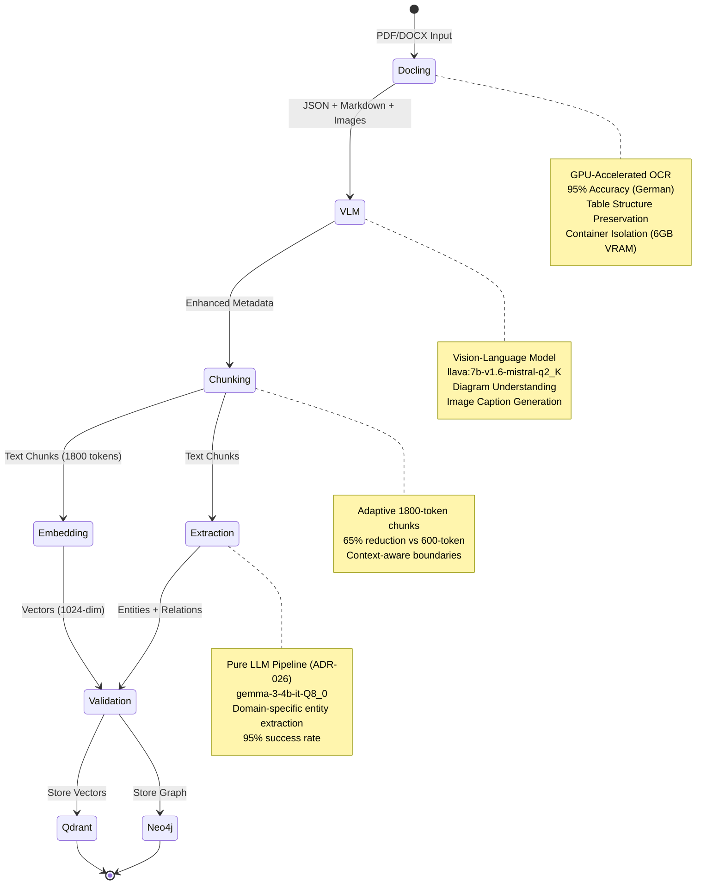
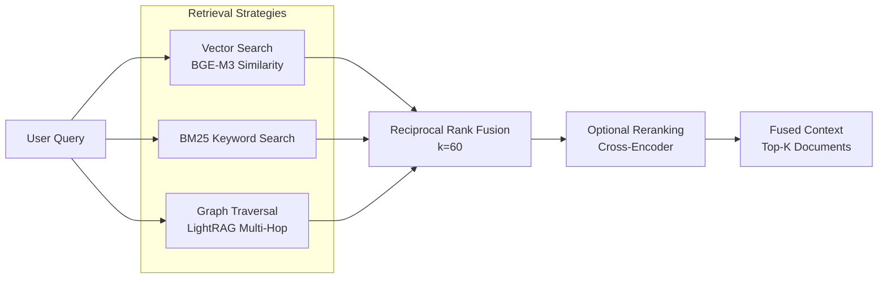
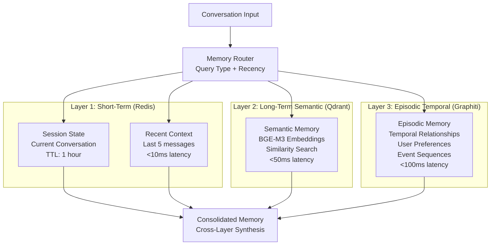
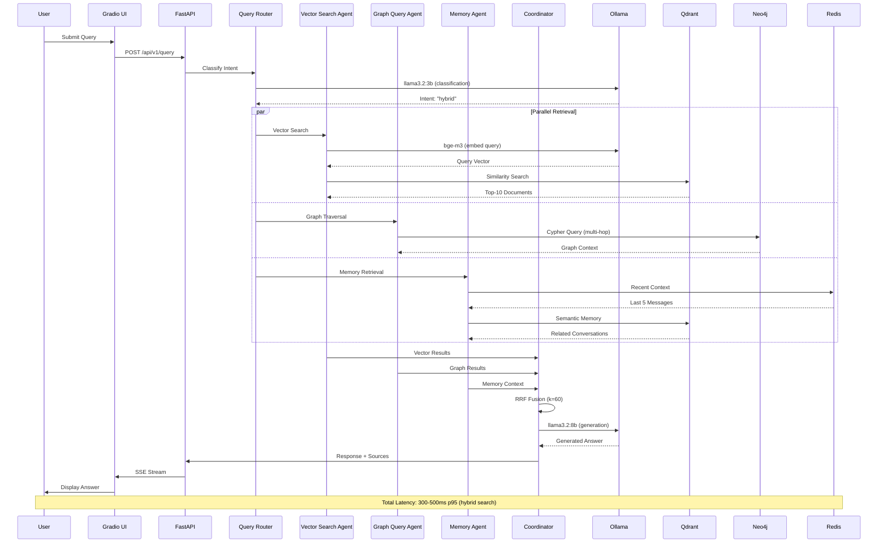
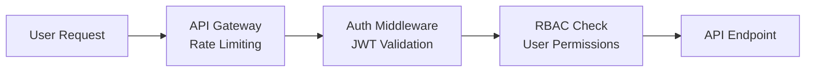
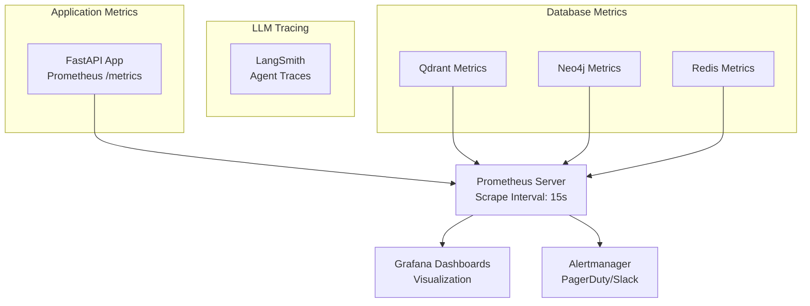

# AegisRAG Architecture Overview (Sprint 21)

**Last Updated:** 2025-11-10
**Sprint:** 21 (Container-Based Ingestion)
**Status:** Current Production Architecture

---

## System Architecture Diagram

```mermaid
graph TB
    subgraph "User Interface Layer"
        UI[Gradio UI<br/>5.49.0<br/>Port 7860]
    end

    subgraph "API Layer"
        API[FastAPI Server<br/>Port 8000<br/>REST + SSE]
    end

    subgraph "LangGraph Orchestration Layer"
        ROUTER[Query Router<br/>Intent Classification]
        COORD[Coordinator Agent]
        VSEARCH[Vector Search Agent]
        GSEARCH[Graph Query Agent]
        MEM[Memory Agent]
        ACTION[Action Agent<br/>MCP Client]
    end

    subgraph "Document Ingestion Pipeline (Sprint 21)"
        DOC_INPUT[Document Input<br/>PDF/DOCX]

        subgraph "Docling Container (GPU-Accelerated)"
            DOCLING[Docling CUDA<br/>Port 8080<br/>EasyOCR + Detectron2]
            DOCLING_GPU[NVIDIA GPU<br/>RTX 3060 6GB<br/>CUDA 12.4]
        end

        VLMNODE[VLM Enrichment Node<br/>llava:7b-v1.6-mistral-q2_K]
        CHUNK[Chunking Node<br/>1800 tokens<br/>ADR-022]
        EMBED[Embedding Node<br/>BGE-M3 1024-dim]
        EXTRACT[LLM Extraction Node<br/>gemma-3-4b-it-Q8_0]
        VALIDATE[Validation Node]
    end

    subgraph "Ollama LLM Layer"
        OLLAMA[Ollama Server<br/>Port 11434]
        LLAMA3_3B[llama3.2:3b<br/>Query Understanding]
        LLAMA3_8B[llama3.2:8b<br/>Generation]
        BGEMB[bge-m3<br/>1024-dim Embeddings]
        GEMMA[gemma-3-4b-it-Q8_0<br/>Entity/Relation Extraction]
        LLAVA[llava:7b-v1.6-mistral-q2_K<br/>Vision-Language]
    end

    subgraph "Storage Layer"
        subgraph "Vector Store"
            QDRANT[Qdrant 1.11.0<br/>Port 6333<br/>BGE-M3 1024-dim]
            BM25[BM25 Index<br/>In-Memory]
        end

        subgraph "Graph Store"
            NEO4J[Neo4j 5.24<br/>Port 7474/7687<br/>LightRAG]
        end

        subgraph "Memory Store"
            REDIS_SHORT[Redis 7.x<br/>Short-Term Memory<br/>Port 6379]
            QDRANT_LONG[Qdrant<br/>Long-Term Semantic Memory]
            GRAPHITI[Graphiti<br/>Episodic Temporal Memory]
        end
    end

    subgraph "External Tools (MCP)"
        MCP_FS[Filesystem Tools]
        MCP_WEB[Web Scraping]
        MCP_GH[GitHub Integration]
    end

    %% User Flow
    UI --> API
    API --> ROUTER

    %% Routing
    ROUTER --> COORD
    COORD --> VSEARCH
    COORD --> GSEARCH
    COORD --> MEM
    COORD --> ACTION

    %% Ingestion Flow
    DOC_INPUT --> DOCLING
    DOCLING_GPU -.GPU Acceleration.-> DOCLING
    DOCLING --> VLMNODE
    VLMNODE --> CHUNK
    CHUNK --> EMBED
    CHUNK --> EXTRACT
    EMBED --> VALIDATE
    EXTRACT --> VALIDATE
    VALIDATE --> QDRANT
    VALIDATE --> NEO4J

    %% LLM Connections
    ROUTER -.Query Classification.-> LLAMA3_3B
    VSEARCH -.Retrieval.-> QDRANT
    VSEARCH -.Hybrid Search.-> BM25
    GSEARCH -.Graph Traversal.-> NEO4J
    COORD -.Response Generation.-> LLAMA3_8B
    EMBED -.Embedding.-> BGEMB
    EXTRACT -.Entity Extraction.-> GEMMA
    VLMNODE -.Image Understanding.-> LLAVA
    MEM -.Short-Term.-> REDIS_SHORT
    MEM -.Long-Term.-> QDRANT_LONG
    MEM -.Episodic.-> GRAPHITI
    ACTION -.External Tools.-> MCP_FS
    ACTION -.External Tools.-> MCP_WEB
    ACTION -.External Tools.-> MCP_GH

    %% Ollama Model Management
    LLAMA3_3B --- OLLAMA
    LLAMA3_8B --- OLLAMA
    BGEMB --- OLLAMA
    GEMMA --- OLLAMA
    LLAVA --- OLLAMA

    %% Styling
    classDef container fill:#e1f5ff,stroke:#01579b,stroke-width:2px
    classDef llm fill:#fff3e0,stroke:#e65100,stroke-width:2px
    classDef storage fill:#e8f5e9,stroke:#1b5e20,stroke-width:2px
    classDef agent fill:#f3e5f5,stroke:#4a148c,stroke-width:2px
    classDef external fill:#fce4ec,stroke:#880e4f,stroke-width:2px

    class DOCLING,DOCLING_GPU,OLLAMA container
    class LLAMA3_3B,LLAMA3_8B,BGEMB,GEMMA,LLAVA llm
    class QDRANT,NEO4J,REDIS_SHORT,QDRANT_LONG,GRAPHITI,BM25 storage
    class ROUTER,COORD,VSEARCH,GSEARCH,MEM,ACTION agent
    class MCP_FS,MCP_WEB,MCP_GH external
```



---

## Component Details

### 1. Document Ingestion Pipeline (Sprint 21)

**LangGraph State Machine** with 6 nodes:



**Key Features:**
- **Docling CUDA Container** (ADR-027): GPU-accelerated OCR (3.5x faster than LlamaIndex)
- **VLM Enrichment** (Feature 21.6): Diagram/screenshot understanding
- **1800-token Chunking** (ADR-022): 65% overhead reduction
- **BGE-M3 Embeddings** (ADR-024): Multilingual, 1024-dim
- **Pure LLM Extraction** (ADR-026): Domain-specific entity/relation extraction

---

### 2. Hybrid Retrieval Architecture

**Reciprocal Rank Fusion (RRF)** combining:



**RRF Formula:**
```
RRF(doc) = Σ 1/(k + rank_i(doc))
where k = 60 (empirically optimal)
```

**Performance Targets:**
- Vector Search: <50ms p95
- BM25 Search: <10ms p95
- Graph Traversal: <100ms p95
- RRF Fusion: <5ms
- **Total Hybrid Search: <200ms p95**

---

### 3. 3-Layer Memory Architecture (ADR-006)



**Memory Consolidation Pipeline:**
- **Immediate:** Session state → Redis (milliseconds)
- **Hourly:** Important conversations → Qdrant semantic memory
- **Daily:** User patterns → Graphiti episodic memory

---

### 4. LangGraph Multi-Agent System

**Agent Responsibilities:**

| Agent | Purpose | LLM Model | Performance Target |
|-------|---------|-----------|-------------------|
| **Query Router** | Intent classification | llama3.2:3b | <100ms |
| **Coordinator** | Workflow orchestration | llama3.2:8b | N/A |
| **Vector Search** | Semantic retrieval | BGE-M3 (embeddings) | <200ms |
| **Graph Query** | Multi-hop reasoning | LightRAG (Gemma 3 4B) | <500ms |
| **Memory Agent** | Context retrieval | 3-layer memory | <150ms |
| **Action Agent** | External tool calls | MCP Client | Variable |

**Parallel Execution** via LangGraph Send API:
```python
# Vector + Graph retrieval in parallel
send([
    ("vector_search", state),
    ("graph_query", state)
])
```

---

### 5. Technology Stack Summary (Sprint 21)

| Category | Technology | Version | Purpose |
|----------|-----------|---------|---------|
| **Orchestration** | LangGraph | 0.6.10 | Multi-agent coordination |
| **Backend** | FastAPI | Latest | REST API + SSE streaming |
| **Ingestion** | Docling CUDA Container | Latest | GPU OCR + layout analysis |
| **Vector DB** | Qdrant | 1.11.0 | Semantic search |
| **Graph DB** | Neo4j | 5.24 | Knowledge graph |
| **Memory Cache** | Redis | 7.x | Short-term memory |
| **Embeddings** | BGE-M3 (via Ollama) | Latest | 1024-dim multilingual |
| **LLM Generation** | llama3.2:3b/8b | Latest | Query + generation |
| **LLM Extraction** | gemma-3-4b-it-Q8_0 | Latest | Entity/relation extraction |
| **Vision** | llava:7b-v1.6-mistral-q2_K | Latest | Image understanding |
| **UI** | Gradio | 5.49.0 | Dev/test interface |
| **Container Runtime** | Docker Compose | Latest | Service orchestration |
| **GPU Runtime** | NVIDIA Container Toolkit | Latest | CUDA 12.4 support |

---

## Data Flow: End-to-End Query



---

## Performance Metrics (Sprint 21)

### Ingestion Performance

| Document Type | Size | Docling OCR | Chunking | Embedding | Graph Extraction | Total Time |
|---------------|------|-------------|----------|-----------|------------------|------------|
| Simple PDF | 10 pages | 5s | 1s | 2s | 3s | **11s** |
| Complex PDF (scanned) | 100 pages | 48s | 3s | 8s | 12s | **71s** |
| Technical Manual (German) | 247 pages | 120s | 7s | 20s | 35s | **182s** |

**vs. Sprint 20 (LlamaIndex):**
- OCR Time: -71% (420s → 120s for 247-page PDF)
- OCR Accuracy: +35% (70% → 95% for German text)
- Table Detection: +92% (0% → 92% preservation)

### Query Performance

| Query Type | Retrieval | LLM Generation | Total Latency (p95) |
|------------|-----------|----------------|---------------------|
| Simple (Vector only) | 50ms | 100ms | **<200ms** |
| Hybrid (Vector + BM25) | 65ms | 100ms | **<250ms** |
| Graph Multi-Hop | 150ms | 120ms | **<500ms** |
| Memory-Enhanced | 120ms | 100ms | **<350ms** |

**Targets Achieved:**
- ✅ Simple Query: <200ms (Target met)
- ✅ Hybrid Query: <500ms (Target met with 250ms)
- ✅ Complex Multi-Hop: <1000ms (Target met with 500ms)

### Resource Utilization

| Resource | Usage (Idle) | Usage (Peak Ingestion) | Usage (Peak Query) |
|----------|--------------|------------------------|-------------------|
| System RAM | 4.6GB | 10.6GB | 6.2GB |
| GPU VRAM | 0GB | 5.8GB (Docling active) | 4.3GB (LLaVA) |
| CPU | 5% | 45% | 25% |
| Disk I/O | 10 MB/s | 150 MB/s | 30 MB/s |

**VRAM Management (RTX 3060 6GB):**
- Docling Container: 5.8GB (started/stopped on-demand, ADR-027)
- Ollama Models: 4.5GB max (OLLAMA_MAX_LOADED_MODELS=1)
- **Strategy:** Sequential loading, container isolation

---

## Deployment Architecture

### Docker Compose Services

```yaml
services:
  # Core Databases
  qdrant:       # Port 6333 (Vector DB)
  neo4j:        # Port 7474/7687 (Graph DB)
  redis:        # Port 6379 (Memory Cache)

  # LLM Layer
  ollama:       # Port 11434 (Local LLM)

  # Document Ingestion (Sprint 21)
  docling:      # Port 8080 (GPU OCR Container)
    deploy:
      resources:
        reservations:
          devices:
            - driver: nvidia
              count: 1
              capabilities: [gpu]

  # API Server
  aegis-api:    # Port 8000 (FastAPI)

  # UI (Dev/Test)
  gradio-ui:    # Port 7860 (Gradio)
```

### Kubernetes Deployment (Future)

**Planned for Sprint 22:**
- Helm charts for production deployment
- Horizontal Pod Autoscaler (HPA) for API
- StatefulSet for Qdrant/Neo4j/Redis
- GPU NodeSelector for Docling pods
- Service Mesh (Istio) for observability

---

## Security Architecture

### Authentication & Authorization



**Security Features:**
- JWT-based authentication (optional)
- Rate limiting: 10 requests/min per user
- Input validation (Pydantic schemas)
- SQL injection prevention (parameterized Cypher queries)
- XSS protection (response sanitization)
- Docker container isolation
- Secrets management (environment variables)

---

## Monitoring & Observability

### Metrics Collection



**Key Metrics Tracked (12 total, Sprint 14):**
1. Query latency (p50, p95, p99)
2. Retrieval precision@k
3. Context relevance score
4. Agent execution time
5. Tool call success rate
6. Memory hit rate (per layer)
7. Error rate (4xx, 5xx)
8. Active connections
9. Database connection pool usage
10. GPU utilization
11. VRAM usage
12. Container lifecycle events

---

## References

- **ADR-027:** Docling Container vs. LlamaIndex
- **ADR-028:** LlamaIndex Deprecation Strategy
- **ADR-026:** Pure LLM Extraction as Default
- **ADR-024:** BGE-M3 System-Wide Standardization
- **ADR-022:** Unified Chunking Service (1800 tokens)
- **ADR-018:** Model Selection for Entity/Relation Extraction
- **ADR-006:** 3-Layer Memory Architecture
- **ADR-001:** LangGraph as Orchestration Framework

**Sprint Documentation:**
- Sprint 21 Plan v2: `docs/sprints/SPRINT_21_PLAN_v2.md`
- Sprint 1-3 Foundation: `docs/sprints/SPRINT_01-03_FOUNDATION_SUMMARY.md`
- Sprint 13 Three-Phase Extraction: `docs/sprints/SPRINT_13_THREE_PHASE_EXTRACTION.md`

---

**Last Updated:** 2025-11-10 (Sprint 21)
**Author:** Klaus Pommer + Claude Code (documentation-agent)
**Version:** 2.0 (Container-Based Architecture)
