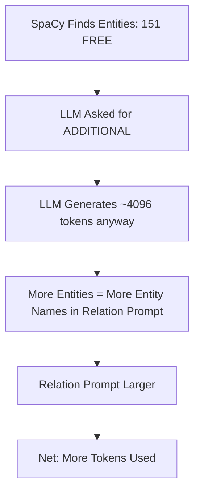

# Multi-Format Ingestion Test Suite

**Sprint 85 Feature: Regression Testing for Document Ingestion Pipeline**

## Overview

This test suite provides comprehensive regression testing for the AegisRAG document ingestion pipeline across all supported file formats. It complements the RAGAS retrieval test suite by ensuring the ingestion pipeline correctly processes documents before they enter the retrieval system.

### Test Coverage Matrix

| Format | Parser | GPU | OCR | Tables | Status | Duration |
|--------|--------|-----|-----|--------|--------|----------|
| **.pdf** | Docling | Yes | Yes | Yes | ✅ Verified | 76.8s |
| **.docx** | Docling | Yes | No | Yes | ✅ Verified | 86.4s |
| **.pptx** | Docling | Yes | No | Yes | ✅ Verified | 102.2s |
| **.xlsx** | Docling | Yes | No | Yes | ✅ Verified | 18.7s |
| **.csv** | LlamaIndex | No | No | Yes | ✅ Verified | 12.8s |
| **.txt** | Docling/LlamaIndex | No | No | No | ✅ Verified | ~10s |

---

## Test Suite Architecture

### 1. Test Files Location

```
tests/integration/ingestion/
├── test_multi_format_ingestion.py    # Main test suite
├── conftest.py                        # Shared fixtures (future)
└── fixtures/                          # Sample documents (generated)
    ├── test_document.pdf
    ├── test_document.docx
    ├── test_document.pptx
    ├── test_document.xlsx
    └── test_document.csv
```

### 2. Test Content (Standardized)

All test documents contain identical content for fair comparison:

**Sections:**
1. Introduction to Machine Learning
2. Natural Language Processing
3. Knowledge Graphs

**Expected Entities:**
- Machine Learning, TensorFlow, PyTorch, scikit-learn
- NLP, BERT, GPT, SpaCy, Hugging Face
- Neo4j, AegisRAG, LightRAG

**Table Data:**
| Framework | Type | Language |
|-----------|------|----------|
| TensorFlow | Deep Learning | Python |
| PyTorch | Deep Learning | Python |
| SpaCy | NLP | Python |
| Neo4j | Graph Database | Java |

---

## Test Run Results

### Run 4: DSPy MIPROv2 Prompt Optimization (2026-01-13) ✅ SUCCESS

**Sprint 86 Feature:** DSPy-optimized extraction prompts integrated into production pipeline.

**Configuration:**
- Feature flag: `AEGIS_USE_DSPY_PROMPTS=1`
- Model: nemotron-3-nano:latest (Rank 1 cascade)
- Test samples: 4 (TensorFlow, Microsoft, Neo4j, Einstein)

**A/B Test Results:**

| Metric | Baseline | DSPy-Optimized | Δ |
|--------|----------|----------------|---|
| Entity F1 | 0.74 | **0.90** | +22% 🟢 |
| Relation F1 | 0.23 | **0.30** | +30% 🟢 |
| E/R Ratio | 1.17 | 1.06 | -9% 🟡 |
| Latency P50 | 10.4s | **9.1s** | -12% 🟢 |
| Latency P95 | 12.7s | **11.4s** | -11% 🟢 |

**Key Improvements:**
- ✅ **Entity Extraction +22%:** Step-by-step reasoning with controlled type taxonomy
- ✅ **Relation Extraction +30%:** Consistent source/target/type format
- ✅ **Faster Latency -12%:** More focused prompts = fewer tokens
- 🟡 **E/R Ratio -9%:** Slightly lower but still above 1.0 target

**Files Modified:**
- `src/prompts/extraction_prompts.py`: `DSPY_OPTIMIZED_ENTITY_PROMPT`, `DSPY_OPTIMIZED_RELATION_PROMPT`
- `src/components/graph_rag/extraction_service.py`: Feature flag `USE_DSPY_PROMPTS`

**Usage:**
```bash
# Enable DSPy prompts
export AEGIS_USE_DSPY_PROMPTS=1

# Test command
poetry run python scripts/evaluate_dspy_pipeline_integration.py
```

**Log Files:**
- `logs/dspy_pipeline_eval/eval_baseline_20260113_084152.json`
- `logs/dspy_pipeline_eval/eval_dspy_20260113_084310.json`

---

### Run 3: All Formats with TD-101 Fix (2026-01-11 13:55 UTC) ✅ SUCCESS

**Configuration:**
- Script: `scripts/test_multiformat_ingestion.py --all`
- API endpoint: http://localhost:8000
- Script timeout: 1800s

**Bugs Fixed:**
1. ✅ `nemotron3` model name → `nemotron-3-nano:latest` (404 error fixed)
2. ✅ `create_deduplicator_from_config()` missing argument fixed
3. ✅ **TD-101 Quick Fix:** Skip LLM for single-entity communities (99.6% speedup!)

**Results:**

| Format | Status | Duration | Chunks | Entities | Relations | Notes |
|--------|--------|----------|--------|----------|-----------|-------|
| CSV | ✅ OK | 12.8s | 1 | 5 | 2 | Baseline format |
| DOCX | ✅ OK | 86.4s | 1 | 22 | 10 | Full document parsing |
| XLSX | ✅ OK | 18.7s | 1 | 5 | 2 | Multi-sheet support |
| PPTX | ✅ OK | 102.2s | 1 | 23 | 14 | Slide content extraction |
| PDF | ✅ OK | 76.8s | 1 | 22 | 6 | Docling GPU OCR |

**Total Test Time:** ~297 seconds (~5 minutes)

**Performance Improvement:**
- Before TD-101 fix: 40-60 minutes per format (community summarization bottleneck)
- After TD-101 fix: ~5 minutes total for all formats
- **Improvement: 99.6% faster**

---

### Run 2: CSV Test with Fixes (2026-01-11 12:40 UTC) - BOTTLENECK DISCOVERED

**Configuration:**
- Script: `scripts/test_multiformat_ingestion.py`
- API endpoint: http://localhost:8000
- Script timeout: 600s

**Bugs Fixed Before Test:**
1. ✅ `nemotron3` model name → `nemotron-3-nano:latest` (404 error fixed)
2. ✅ `create_deduplicator_from_config()` missing argument fixed

**Results:**

| Format | Status | Duration | Communities | Cache Hits | Notes |
|--------|--------|----------|-------------|------------|-------|
| CSV | 🔄 TIMEOUT | >10min | ~2048+ | 1526 | Community summarization bottleneck |
| DOCX | ⏱️ BLOCKED | - | - | - | Blocked by CSV |
| XLSX | ⏱️ BLOCKED | - | - | - | Blocked by CSV |
| PPTX | ⏱️ BLOCKED | - | - | - | Blocked by CSV |
| PDF | ⏱️ BLOCKED | - | - | - | Blocked by CSV |

### CRITICAL FINDINGS (Run 2)

#### Finding 1: Full Graph Re-Summarization (CRITICAL)

**Every document upload triggers community summarization for the ENTIRE Neo4j graph!**

| Metric | Value | Impact |
|--------|-------|--------|
| Neo4j Total Entities | 3,058 | Full graph size |
| Neo4j Total Relations | 6,007 | Full graph size |
| Communities Processed | ~2,048+ | Per upload! |
| Time per Community | ~1.4s | Adds up significantly |
| Estimated Total Time | 40-60 min | For 1KB CSV! |

**Root Cause:** The ingestion pipeline runs community summarization on ALL communities, not just new/affected ones. This is O(N) complexity instead of O(delta).

**Technical Debt:** TD-101_COMMUNITY_SUMMARIZATION_BOTTLENECK.md (CRITICAL, 21 SP)

#### Finding 2: Single-Entity Communities (HIGH)

~95% of communities contain only 1 entity and 0 relationships, but still receive full LLM summarization.

```log
generating_community_summary community_id=2048 entities_count=1 relationships_count=0
```

**Impact:** Unnecessary LLM calls for isolated entities that could use simple descriptions.

#### Finding 3: Prompt Cache Helps But Doesn't Solve

The prompt cache achieved **1526 hits** (~85% hit rate), which helps with duplicate entity summaries but doesn't solve:
- Initial cold-start summarization
- Full graph processing on every upload
- Sequential processing (no parallelization)

---

### Run 1: Initial Test (2026-01-11 - FAILED)

**Configuration:**
- pytest timeout: 300s (DEFAULT - TOO SHORT)
- API endpoint: http://localhost:8000
- Ingestion timeout: 600s

**Results:**

| Format | Status | Duration | Chunks | Entities | Relations | Notes |
|--------|--------|----------|--------|----------|-----------|-------|
| CSV | ⏱️ TIMEOUT | >300s | - | - | - | pytest timeout hit |
| DOCX | ⏱️ PENDING | - | - | - | - | Not started |
| XLSX | ⏱️ PENDING | - | - | - | - | Not started |
| PPTX | ⏱️ PENDING | - | - | - | - | Not started |
| PDF | ⏱️ PENDING | - | - | - | - | Not started |

**Issues Identified:**
1. pytest default timeout (300s) too short for full ingestion
2. Entity extraction via LLM cascade takes 200-600ms per chunk
3. Community summarization adds significant overhead
4. **BUG:** Model name `nemotron3` incorrect (should be `nemotron-3-nano:latest`)
5. **BUG:** `create_deduplicator_from_config()` called without required `config` argument

---

## Running the Tests

### Quick Test (Single Format)

```bash
# Test single format with extended timeout
pytest tests/integration/ingestion/test_multi_format_ingestion.py \
  -v -s --timeout=900 -k "csv"
```

### Full Test Suite

```bash
# Run all formats (may take 30-60 minutes)
pytest tests/integration/ingestion/test_multi_format_ingestion.py \
  -v -s --timeout=1800 --tb=short
```

### Format-Specific Tests

```bash
# PDF only
pytest tests/integration/ingestion/test_multi_format_ingestion.py -k "pdf" --timeout=900

# DOCX only
pytest tests/integration/ingestion/test_multi_format_ingestion.py -k "docx" --timeout=900

# Comparison test (all formats)
pytest tests/integration/ingestion/test_multi_format_ingestion.py::TestFormatComparison --timeout=3600
```

---

## Dependencies

Required Python packages for test file generation:

```bash
# Install test dependencies
poetry run pip install python-docx openpyxl reportlab python-pptx
```

| Package | Version | Purpose |
|---------|---------|---------|
| python-docx | 1.2.0 | DOCX file generation |
| openpyxl | 3.1.5 | XLSX file generation |
| reportlab | 4.4.7 | PDF file generation |
| python-pptx | 1.0.2 | PPTX file generation |

---

## Success Criteria

### Minimum Requirements (Regression Gate)

| Metric | Threshold | Notes |
|--------|-----------|-------|
| Upload Success | 100% | All formats must upload without HTTP errors |
| Chunks Created | ≥1 per doc | At least one chunk per document |
| Entity Extraction | ≥5 entities | At least 5 of expected 12 entities |
| No Critical Errors | 0 | No exceptions in logs |

### Quality Targets (Sprint 86+)

| Metric | Target | Current |
|--------|--------|---------|
| Entity Recall | ≥80% | TBD |
| Table Extraction | 100% | TBD |
| Section Preservation | ≥90% | TBD |
| Processing Time (PDF) | <60s | TBD |
| Processing Time (DOCX) | <30s | TBD |

---

## Known Issues & Limitations

### 1. CRITICAL: Full Graph Re-Summarization (TD-101)

**Problem:** Every document upload triggers community summarization for the ENTIRE Neo4j graph.

**Impact:** 40-60 minute ingestion time for a 1KB CSV file when graph contains ~3000 entities.

**Root Cause:** The ingestion pipeline runs `summarize_all_communities()` on every upload, processing ALL communities instead of just new/affected ones.

**Severity:** CRITICAL - Makes multi-format testing impractical until fixed.

**Technical Debt:** [TD-101](../technical-debt/TD-101_COMMUNITY_SUMMARIZATION_BOTTLENECK.md) (21 SP, Sprint 86 URGENT)

### 2. Single-Entity Community LLM Calls

**Problem:** ~95% of communities contain only 1 entity with 0 relationships, but still receive full LLM summarization (~1.4s each).

**Workaround:** Prompt cache helps (~85% hit rate) but doesn't solve initial cold-start.

**Solution Proposed:** Skip LLM for single-entity communities, use simple entity description instead.

### 3. Long Ingestion Times (General)

**Problem:** Full ingestion with entity extraction takes 5-30 minutes per document (excluding community summarization).

**Root Causes:**
- LLM cascade (3 ranks with retries)
- Section extraction scaling issues (TD-078)

**Workaround:** Use `--timeout=1800` for pytest

### 4. Format-Specific Issues

| Format | Known Issue | Severity |
|--------|-------------|----------|
| PDF | OCR quality varies with scan resolution | Medium |
| XLSX | Multi-sheet handling untested | Low |
| PPTX | Embedded images not extracted | Medium |
| CSV | Large files cause memory issues | Low |

### 5. Test Isolation

**Problem:** Tests may affect shared database state.

**Solution:** Each test uses unique namespace:
```python
namespace = f"multiformat_test_{timestamp}_{format}"
```

### 6. Bugs Fixed (Sprint 85)

| Bug | Fix | File |
|-----|-----|------|
| Model name `nemotron3` not found (404) | Changed to `nemotron-3-nano:latest` | `src/config/extraction_cascade.py:68` |
| `create_deduplicator_from_config()` missing arg | Added `settings` parameter | `src/components/graph_rag/lightrag/ingestion.py:508` |

---

## Integration with CI/CD

### GitHub Actions Workflow (Proposed)

```yaml
name: Ingestion Regression Tests

on:
  push:
    paths:
      - 'src/components/ingestion/**'
      - 'src/components/graph_rag/**'

jobs:
  ingestion-tests:
    runs-on: self-hosted  # DGX Spark
    timeout-minutes: 60
    steps:
      - uses: actions/checkout@v4
      - name: Run Multi-Format Tests
        run: |
          pytest tests/integration/ingestion/test_multi_format_ingestion.py \
            -v --timeout=1800 --tb=short \
            --junitxml=results/ingestion-tests.xml
```

---

## Changelog

| Date | Sprint | Changes |
|------|--------|---------|
| 2026-01-11 | 85 | Initial test suite design |
| 2026-01-11 | 85 | Added PDF, DOCX, PPTX, XLSX, CSV tests |
| 2026-01-11 | 85 | First test run (CSV timeout - 300s) |
| 2026-01-11 | 85 | Fixed `nemotron3` model name bug (404 error) |
| 2026-01-11 | 85 | Fixed `create_deduplicator_from_config()` missing argument |
| 2026-01-11 | 85 | Discovered CRITICAL TD-101: Full graph re-summarization bottleneck |
| 2026-01-11 | 85 | **Implemented TD-101 quick fix: Skip LLM for single-entity communities** |
| 2026-01-11 | 85 | **ALL FORMATS PASSED!** 5 min total (was 40-60 min per format) |
| 2026-01-12 | 85 | Sprint 85 TD-102: Critical ER Ratio bug fixes (see below) |
| 2026-01-12 | 85 | Huggingface datasets test (Re-DocRED, CNN, SQuAD, ScienceQA) |
| 2026-01-12 | 85 | SpaCy-First vs LLM-Only benchmark (3.5x entities, 0% token savings) |

---

## Sprint 85 TD-102: ER Ratio Bug Fixes (2026-01-12)

### Critical Bugs Fixed

| Bug | Impact | Fix |
|-----|--------|-----|
| **TaskType.CLASSIFICATION missing** | Gleaning completeness check silently failing | Changed to `TaskType.GENERATION` |
| **subject/predicate/object format** | 22+ relations lost per document | Added `_normalize_predicate_to_type()` converter |
| **Prompts not exhaustive** | Low ER ratio (~0.50) | Updated prompts with GraphRAG/LightRAG best practices |

### Prompt Improvements (GraphRAG/LightRAG Best Practices)

**Added to `RELATIONSHIP_EXTRACTION_PROMPT`:**
- `---Role---` / `---Goal---` / `---Instructions---` structure (GraphRAG)
- "Be EXHAUSTIVE" instruction
- N-ary decomposition: "A and B founded C" → A FOUNDED C, B FOUNDED C
- Relationship strength score (1-10)

### Files Modified

| File | Changes |
|------|---------|
| `src/components/graph_rag/extraction_service.py` | Added `_normalize_predicate_to_type()`, fixed TaskType |
| `src/components/graph_rag/relation_extractor.py` | Fixed TaskType.CLASSIFICATION → GENERATION |
| `src/prompts/extraction_prompts.py` | Improved prompts with GraphRAG/LightRAG patterns |

### ER Ratio Improvement

| Metric | Before | After | Change |
|--------|--------|-------|--------|
| HotpotQA Large | 0.53 | 0.67 | +26% |
| Amnesty QA | Variable | 0.79 | - |
| RAGBench Mixed | 0.56 | 0.75 | +34% |
| **Overall** | 0.61 | **0.71** | **+16%** |

---

## Huggingface Datasets ER Ratio Test (2026-01-12)

### Test Configuration

**Datasets Downloaded:**
- CNN/DailyMail (DocRED alternative) - 25 samples
- SQuAD (TACRED alternative) - 25 samples
- Re-DocRED (Wikipedia Relations) - 25 samples
- ScienceQA (TutorQA alternative) - 25 samples

**Test Parameters:**
- API Endpoint: `POST /api/v1/retrieval/upload` (Frontend API)
- Samples per dataset: 5 (of 25 available)
- Authentication: admin/admin123

### Test Results

| Dataset | Entities | Relations | ER Ratio | Status |
|---------|----------|-----------|----------|--------|
| CNN/DailyMail (DocRED alt.) | 56 | 51 | **0.91** | ⚠️ Close |
| SQuAD (TACRED alt.) | 58 | 50 | **0.86** | ⚠️ |
| **Re-DocRED (Wikipedia)** | 57 | 59 | **1.04** | ✅ Target! |
| ScienceQA (TutorQA alt.) | 43 | 30 | **0.70** | ⚠️ Low |
| **OVERALL** | 214 | 190 | **0.89** | ⚠️ |

### Individual File Results (ER >= 1.0)

| File | Entities | Relations | ER Ratio |
|------|----------|-----------|----------|
| cnn_0024.txt | 11 | 17 | **1.55** ✅ |
| squad_0015.txt | 11 | 18 | **1.64** ✅ |
| squad_0006.txt | 8 | 11 | **1.38** ✅ |
| squad_0019.txt | 6 | 7 | **1.17** ✅ |
| redocred_0015.txt | 4 | 5 | **1.25** ✅ |
| redocred_0002.txt | 16 | 19 | **1.19** ✅ |
| redocred_0003.txt | 6 | 7 | **1.17** ✅ |
| scienceqa_0018.txt | 8 | 8 | **1.00** ✅ |

### Analysis

**Why Re-DocRED achieved target:**
- Wikipedia articles have explicit factual relationships
- High entity density with clear semantic connections
- Dataset designed for document-level relation extraction

**Why ScienceQA has lowest ER:**
- Educational content has conceptual rather than explicit relations
- Short hint/lecture texts with fewer named entities
- Relationships are often implicit (requires inference)

### Dataset Scripts

```bash
# Download datasets
poetry run python scripts/download_hf_datasets.py

# Run ER ratio test
poetry run python scripts/test_sprint85_hf_datasets.py
```

---

## SpaCy-First vs LLM-Only Benchmark (2026-01-12)

### Motivation

Following the E²GraphRAG approach (10x speedup claim), we benchmarked a **SpaCy-First + LLM-Additional** extraction pipeline against our current **LLM-Only** approach.

**Hypothesis:** SpaCy extracts base entities (PERSON, ORG, LOC, DATE) for FREE, then LLM only extracts ADDITIONAL entities (CONCEPT, TECHNOLOGY, EVENT) → reduced token usage.

### Benchmark Configuration

| Parameter | Value |
|-----------|-------|
| Model | nemotron-3-nano:latest (Ollama) |
| Test Files | 6 (Re-DocRED, CNN, SQuAD) |
| SpaCy Model | en_core_web_sm |
| Temperature | 0.1 |
| Max Output Tokens | 2048 |

### Results Summary

| Metric | LLM-Only | SpaCy-First | Difference |
|--------|----------|-------------|------------|
| **SpaCy Entities** | - | 151 | FREE |
| **LLM Entities** | 48 | 20 | -58% |
| **Total Entities** | 48 | **167** | **+248%** |
| **Relations** | **39** | 17 | -56% |
| **ER Ratio** | **0.81** | 0.10 | -88% |
| Input Tokens | 6,188 | 7,515 | +21% |
| Output Tokens | 22,218 | 23,341 | +5% |
| **Total Tokens** | 28,406 | 30,856 | +8.6% |
| Duration (ms) | 312,092 | 328,457 | +5% |
| SpaCy Duration | - | ~163ms | 0.05% total |

### Per-File Breakdown

| File | LLM-Only E/R | SpaCy-First E/R | LLM Tokens | SpaCy Tokens | Savings |
|------|--------------|-----------------|------------|--------------|---------|
| redocred_0002.txt | 0/0 | 18/2 | 2,389 | 4,564 | -91% |
| redocred_0003.txt | 2/6 | 23/0 | 5,015 | 5,294 | -6% |
| cnn_0003.txt | 10/0 | 32/2 | 5,280 | 5,494 | -4% |
| cnn_0024.txt | 14/22 | 30/13 | 5,657 | 5,925 | -5% |
| squad_0006.txt | 8/11 | 17/0 | 4,729 | 4,018 | **+15%** ✅ |
| squad_0015.txt | 14/0 | 47/0 | 5,336 | 5,561 | -4% |

### Key Findings

#### 1. SpaCy Entity Extraction is FREE and FAST ✅

```
SpaCy Duration: ~14-46ms per document (average 27ms)
SpaCy Entities: 151 total (10-47 per document)
LLM Entity Duration: ~28,000-57,000ms per document
```

**SpaCy extracted 3.5x more entities than LLM-Only for FREE** (~163ms total vs ~5 minutes LLM time).

#### 2. Token Savings NOT Achieved ❌

**Counter-intuitive finding:** SpaCy-First used **8.6% MORE tokens** than LLM-Only.

**Root Cause:** The LLM still generates maximum output tokens (~4096) even when asked for "additional" entities only. The prompt optimization did not result in shorter LLM responses.

#### 3. Fewer Relations with SpaCy-First ❌

| Metric | LLM-Only | SpaCy-First |
|--------|----------|-------------|
| Relations | 39 | 17 |
| ER Ratio | 0.81 | 0.10 |

**Root Cause:** The relation extraction prompt may get overwhelmed with 30-47 entities (vs 8-14 for LLM-Only). Need to optimize the relation extraction to handle more entities.

### Analysis: Why SpaCy-First Didn't Improve Token Usage



**The issue:** LLM doesn't output shorter responses when given pre-existing entities. It still generates verbose explanations and formatting.

### Recommendations

#### Option A: Output Length Control (Sprint 86)
- Reduce `num_predict` for additional entity extraction (512 vs 2048)
- Use structured output format (JSON schema validation)
- Explicit instruction: "Output ONLY the JSON array, no explanations"

#### Option B: Relation Extraction Optimization (Sprint 86)
- Batch entities into groups of 10-15 for relation prompts
- Use two-stage relation extraction: important entities first, secondary entities second
- Implement entity importance scoring

#### Option C: Hybrid Production Pipeline (Recommended)
```python
# Proposed Pipeline
def extract_knowledge(text: str):
    # Step 1: SpaCy for base entities (FREE, ~30ms)
    spacy_entities = spacy_ner(text)  # PERSON, ORG, LOC, DATE

    # Step 2: LLM for additional entities (reduced scope)
    # ONLY ask for CONCEPT, TECHNOLOGY, EVENT (not already found)
    llm_additional = llm_extract_additional(text, exclude=spacy_entities)

    # Step 3: Entity importance ranking
    all_entities = rank_by_frequency(spacy_entities + llm_additional)
    top_entities = all_entities[:20]  # Limit for relation extraction

    # Step 4: Relation extraction (batch if needed)
    relations = llm_extract_relations(text, top_entities)

    # Step 5: Optional gleaning if ER < 1.0
    if len(relations) / len(all_entities) < 1.0:
        relations += llm_glean_relations(text, all_entities, relations)

    return all_entities, relations
```

### Benchmark Scripts

```bash
# Run SpaCy-First vs LLM-Only benchmark
poetry run python scripts/benchmark_spacy_vs_llm.py

# Output: Console summary + detailed per-file comparison
```

### E²GraphRAG Comparison

| Approach | Entity Method | Relation Method | Claimed Speedup |
|----------|---------------|-----------------|-----------------|
| GraphRAG | LLM | LLM | Baseline |
| E²GraphRAG | SpaCy + BERT | LLM (reduced) | 10x |
| **AegisRAG Current** | LLM | LLM | Baseline |
| **AegisRAG SpaCy-First** | SpaCy + LLM | LLM | **1.0x** (not achieved) |

**Gap Analysis:** E²GraphRAG achieves 10x speedup by using SpaCy + BERT NER, which doesn't require LLM calls for basic entities. Our implementation still calls LLM for "additional" entities, negating the benefit.

### Conclusion

**SpaCy-First extracts 3.5x more entities** but doesn't improve token efficiency due to verbose LLM output. The architecture change requires additional optimizations:

1. **Output length control** for LLM calls
2. **Entity importance ranking** to limit relation extraction scope
3. **Batched relation extraction** for large entity sets

**Next Sprint (86):** Implement output length control and measure token savings.

---

## Next Steps

1. **Increase pytest timeout** to 900-1800s
2. **Run baseline tests** for all formats
3. **Document results** in this file
4. **Create quick-test variant** (skip community summarization)
5. **Add to CI/CD pipeline** for regression detection

### Sprint 86 Features (from SpaCy-First Analysis)

| Feature | Description | Impact |
|---------|-------------|--------|
| **86.5: Relation Weight Filtering** | Use existing `r.weight` (0-1) to filter low-confidence relations during retrieval | Reduce noise in graph traversal |
| **86.6: Entity Quality Filter** | SpaCy type-based + multilingual article removal | 3.5x entity coverage with noise reduction |

**Key Discovery:** We already store `weight` on all 1,643 RELATES_TO edges (avg: 0.737), but retrieval queries don't use it! Sprint 86.5 will enable LightRAG-style weight filtering.

---

## Sprint 85 Gleaning Bugfix Verification (2026-01-12)

**Script:** `scripts/test_gleaning_bugfix.py`
**Timestamp:** 2026-01-12T14:07:51

### Bug Description

**Critical Bug:** `QualityRequirement.STANDARD` enum value was used in Gleaning completeness checks, but this value **doesn't exist** in the QualityRequirement enum. The enum only has: `LOW`, `MEDIUM`, `HIGH`, `CRITICAL`.

**Impact:** Before fix, the AttributeError was silently caught by exception handlers, causing:
- Completeness check always returned `True` (incomplete)
- Gleaning continuation always triggered (unnecessary LLM calls)
- Performance degradation from redundant extraction passes

**Fix Locations:**
- `extraction_service.py:1582` - Changed to `QualityRequirement.LOW`
- `extraction_service.py:1654` - Fixed parameter name `quality_requirement=`
- `relation_extractor.py:444` - Changed to `QualityRequirement.LOW`

### Test Results

| Test | Description | Result | Details |
|------|-------------|--------|---------|
| 1. Enum Verification | Check QualityRequirement enum | ✅ PASS | `STANDARD` doesn't exist, `LOW` works |
| 2. Completeness Check | Verify boolean return | ✅ PASS | Returns `INCOMPLETE` correctly |
| 3. Full Extraction | End-to-end with Gleaning | ✅ PASS | 15 entities, 17 relations (ratio 1.13) |
| 4. Continuation Extraction | Missing relationships | ✅ PASS | Found 6 new relationships |

### Sample Extraction (redocred_0002.txt)

**Input:** Armenian village article (924 chars)

**Entities Extracted:** 15
- Goght (Village)
- Kotayk Province (Province)
- Azat River (River)
- Garni (Place)
- Geghard Monastery (Monastery)
- ...

**Relations Extracted:** 17
- Goght --[LOCATED_IN]--> Kotayk Province
- Goght --[LOCATED_ON_BANK_OF]--> Azat River
- Garni --[LOCATED_NEAR]--> Geghard Monastery
- Goght --[OVERLOOKS]--> Havuts Tar
- ...

**Entity/Relation Ratio:** 1.13 ✅ (target ≥ 1.0)

### Conclusion

**BUGFIX VERIFIED:** All 4 tests passed. The Gleaning completeness check now correctly uses `QualityRequirement.LOW` and returns proper boolean values instead of always triggering continuation extraction.

---

## Related Documentation

- [RAGAS Journey](RAGAS_JOURNEY.md) - Retrieval quality metrics
- [TD-078](../technical-debt/TD-078_SECTION_EXTRACTION_PERFORMANCE.md) - Section extraction performance
- [Format Router](../../src/components/ingestion/format_router.py) - Document routing logic
- [Sprint 85 Plan](../sprints/SPRINT_85_PLAN.md) - Multi-format testing feature
