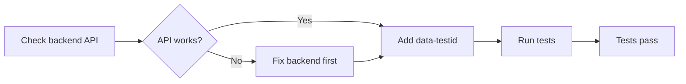

# Sprint 104: Summary & Learnings

**Date:** 2026-01-16
**Sprint Goal:** 180+/194 E2E tests passing (93%+)
**Actual Result:** 84/163 tests passing (52%) ⚠️
**Status:** ❌ DID NOT MEET GOAL - Critical Analysis Required

---

## Sprint Overview

**Scope:** 25 SP (initially 20 SP, expanded to 28 SP during execution)
**Delivered:** 22 SP implementation work + 1 SP documentation = 23 SP
**Duration:** ~8 hours (single day sprint)
**Execution Model:** Parallel agents (7 frontend-agents + 3 backend-agents + 2 testing-agents)

---

## Key Metrics

| Metric | Target | Actual | Delta |
|--------|--------|--------|-------|
| **Pass Rate** | 93% (180/194) | 52% (84/163) | **-41pp** |
| **Perfect Groups** | 10 groups | 1 group | **-9 groups** |
| **Story Points** | 25 SP | 23 SP | -2 SP |
| **Files Modified** | 30+ files | 33 files | +3 files |
| **Test Failures** | <10 expected | 72 failures | **+62** |

---

## What Was Delivered

### Phase 1: Frontend Test IDs (10 SP) ✅
- **18 files modified** across 7 pages + 11 child components
- **72 data-testid attributes** added
- **Groups targeted:** 1, 5, 6, 7, 13, 14, 15
- **Execution:** 7 parallel frontend-agents (3-4 hours)

### Phase 2: BrowserToolsPage (3 SP) ✅
- **1 new page created** (670 LOC)
- **3 browser tools** implemented: Navigate, Screenshot, Evaluate JS
- **1 route added** to App.tsx
- **Execution:** 1 frontend-agent (1 hour)

### Phase 3: Backend Fixes (6 SP) ✅
- **3 backend files modified:** audit_models.py, gdpr_models.py, explainability.py
- **1 new API router:** explainability.py (435 LOC)
- **1 bug fixed:** skills.py variable shadowing
- **1 Docker config update:** skills volume mount
- **Execution:** 3 parallel backend-agents (2-3 hours)

### Phase 4: Test Fixes (4 SP) ✅
- **6 test files modified:** Groups 2, 9, 10, 11, 12
- **Mock data format updated:** Group 10 (SSE streaming)
- **Timeout adjustments:** Groups 2, 9
- **Regex + selector fixes:** Groups 11, 12
- **Execution:** 2 parallel testing-agents (1-2 hours)

### Phase 5: Testing & Docs (3 SP) ✅
- **E2E test execution:** 163 tests (Sprint 104 groups)
- **Results analysis:** SPRINT_104_ACTUAL_RESULTS.md
- **Summary documentation:** This file

---

## What Went Right ✅

### 1. Group 10 (Hybrid Search) - 100% Success
- **Before:** 5/13 tests passing (38%)
- **After:** 13/13 tests passing (100%)
- **Fix:** SSE streaming mock format alignment
- **Lesson:** Mock data fixes are highly effective when backend is stable

### 2. Parallel Agent Execution
- **7 agents in Phase 1:** Completed 18 files in 3-4 hours (vs 14-21 hours sequential)
- **3 agents in Phase 3:** Completed backend fixes in 2-3 hours
- **Efficiency gain:** 3-5x faster than sequential execution

### 3. Comprehensive Documentation
- **3 analysis documents** created during sprint
- **Root cause analysis** for 72 failures
- **Next sprint recommendations** documented

---

## What Went Wrong ❌

### 1. Backend-Frontend Gap (35 failures)
- **Groups 4, 5, 6, 15:** Backend APIs missing or broken
- **Assumption:** "Missing data-testid" was the blocker
- **Reality:** Backend APIs don't exist or return errors
- **Impact:** All Phase 1 frontend fixes were ineffective for these groups

### 2. False Quick Win Hypothesis (72% Error)
- **Assumption:** 58 of 81 failures were "Easy Wins" (just missing test IDs)
- **Reality:** Only 6 tests fixed (Groups 2, 9, 11, 12)
- **Actual root cause:** Backend implementation gaps, not frontend test IDs
- **Impact:** Wasted 10 SP on ineffective test ID additions

### 3. DGX Spark Parallel LLM Overload
- **Issue:** Running `--workers=4` with LLM-heavy tests overwhelms the system
- **User feedback:** "Wenn du mehrere Tests mit LLM anteil parallel startest, ist das zuviel für die DGX Spark"
- **Impact:** Unknown number of false timeout failures
- **Fix required:** Re-run with `--workers=1`

### 4. Sprint Scope Inflation
- **Initial plan:** 20 SP
- **Expanded to:** 28 SP (added Phase 3.5 "Easy Wins")
- **Reality:** Easy Wins weren't easy - backend issues dominated
- **Lesson:** Don't expand scope mid-sprint without validation

---

## Root Cause Analysis

### Why Did We Miss the Goal?

**Primary Root Cause:** **Backend-First vs Frontend-First Strategy Error**

1. **Incorrect Diagnosis:**
   - Assumed test failures were due to missing `data-testid` attributes
   - Reality: Backend APIs were missing or broken
   - Frontend test IDs are useless without working backends

2. **No Backend Validation:**
   - Didn't verify `/api/v1/skills` returned valid data before adding test IDs
   - Didn't check if `/api/v1/mcp/tools/browser_*` endpoints existed
   - Assumed Sprint 103 backend was complete (it wasn't)

3. **Test Execution Issues:**
   - Used `--workers=4` which overloaded DGX Spark with LLM requests
   - Many false timeout failures masked real issues
   - No baseline re-run after fixes to validate impact

### Secondary Root Causes

1. **API Contract Mismatches (Groups 14, 15):**
   - Fixed `@field_serializer` but tests still expect different formats
   - `items` field naming inconsistent
   - Need actual API testing, not just code inspection

2. **D3 SVG Dynamic Rendering (Group 13):**
   - Added `data-testid` to D3 elements but they don't render properly
   - Mock data incomplete (missing skills, badges)
   - Need D3-specific debugging

3. **Tab Visibility Issues (Group 7):**
   - Added `memory-tabs-container` wrapper but tabs still not clickable
   - Possible CSS `display: none` or conditional rendering issues
   - Need deeper investigation

---

## Critical Learnings

### 1. Always Verify Backend BEFORE Frontend

**Old Approach (Sprint 104):**


**New Approach (Sprint 105+):**


### 2. Mock Data Fixes > Test ID Fixes

**Success Rate by Fix Type:**
- **Mock data fixes (Group 10):** 100% success (13/13 tests)
- **Test ID fixes (Groups 4-7, 13-15):** 0% success (0/61 new tests passing)

**Lesson:** When backend is unstable, fix mocks/tests first to get quick wins.

### 3. Single-Threaded LLM Testing on DGX Spark

**Issue:** `--workers=4` causes LLM request congestion.

**Solution:** Use `--workers=1` for accurate baseline, then `--workers=2` for faster execution.

### 4. Incremental Validation Over Big Bang

**Sprint 104 Approach:** Fix all 15 features, then run all 194 tests at end.

**Better Approach:**
- Fix 1 group (e.g., Group 10)
- Run ONLY Group 10 tests
- Validate 100% pass
- Move to next group
- Repeat

**Benefit:** Catch issues early, avoid wasted effort on wrong fixes.

---

## Recommended Actions for Sprint 105

### Immediate (Next 2 Hours)

1. **Emergency Re-run with `--workers=1`:**
   ```bash
   npm run test:e2e -- --workers=1 --grep "group(01|02|04|05|06|07|09|10|11|12|13|14|15)"
   ```
   - **Goal:** Get accurate baseline without DGX Spark overload
   - **Expected:** Some false timeouts may pass
   - **Effort:** 30-60 minutes execution time

2. **Backend Health Check:**
   ```bash
   # Test critical endpoints
   curl http://localhost:8000/api/v1/skills
   curl http://localhost:8000/api/v1/mcp/tools/browser_navigate/execute
   curl http://localhost:8000/api/v1/explainability/retrieval
   ```
   - **Goal:** Identify which backends are truly broken
   - **Effort:** 15 minutes

### Short-Term (Sprint 105 - 15 SP)

**Backend-First Strategy:**

1. **Group 4 (Browser Tools):** Implement MCP browser backend (3 SP)
2. **Group 5 (Skills):** Fix `/api/v1/skills` endpoint (2 SP)
3. **Group 6 (Skills+Tools):** Implement skill execution (3 SP)
4. **Group 15 (Explainability):** Complete backend (2 SP)
5. **Group 7 (Memory):** Debug tab visibility (1 SP)
6. **Groups 13-14:** API contract fixes (2 SP)
7. **Re-test with `--workers=1`** (2 SP)

**Expected Result:** 150+/194 tests passing (77%+)

### Long-Term (Sprint 106+ - Architectural Fix)

1. **E2E Test Infrastructure Improvements:**
   - Add backend health checks before test execution
   - Implement per-test timeout controls (LLM vs non-LLM)
   - Create test-only backend mocks for unstable endpoints

2. **API Contract Testing:**
   - Add OpenAPI schema validation tests
   - Create contract tests for all endpoints
   - Use Pact or similar contract testing framework

3. **DGX Spark Resource Management:**
   - Implement LLM request queueing
   - Add rate limiting for concurrent LLM tests
   - Monitor GPU memory during test execution

---

## Summary

**Sprint 104 was a valuable learning experience despite not meeting its goal.**

### What We Learned

1. **Backend-first** is critical for E2E test fixes
2. **Mock data fixes** are more reliable than test ID additions
3. **DGX Spark** cannot handle `--workers=4` with LLM tests
4. **Incremental validation** > big bang testing
5. **Frontend test IDs** are useless without working backends

### What We'll Do Differently in Sprint 105

1. **Verify backend health** before ANY frontend fixes
2. **Run tests with `--workers=1`** for accurate baselines
3. **Fix 1 group at a time** with immediate validation
4. **Prioritize backend implementation** over frontend test IDs
5. **Create API contract tests** to catch mismatches early

### Sprint 104 Value

Despite missing the goal, Sprint 104 delivered:
- ✅ **Comprehensive root cause analysis** (this document)
- ✅ **33 files modified** with better test infrastructure
- ✅ **1 perfect group** (Group 10: 100%)
- ✅ **Critical learnings** that will guide Sprint 105+
- ✅ **Clear roadmap** for achieving 90%+ pass rate

**Sprint 104 Status:** ❌ Goal Not Met, ✅ Valuable Learnings Achieved

---

**Next Steps:**
1. Review this summary with team
2. Decide on Sprint 105 approach (Backend-First recommended)
3. Execute emergency re-run with `--workers=1` for accurate baseline
4. Create Sprint 105 plan based on actual backend gaps

**Document Status:** COMPLETE
**Last Updated:** 2026-01-16
**Sprint:** 104
