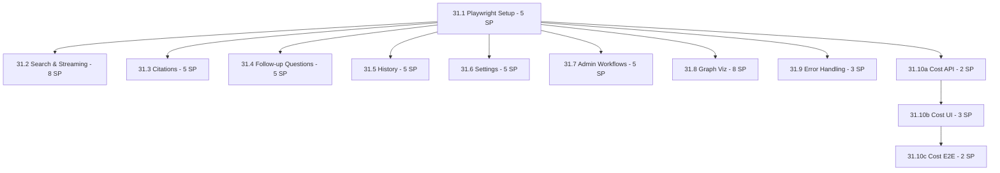

# Sprint 31 Parallelization Plan: Maximum Throughput Strategy

**Goal:** Execute 54 SP in ~4-5 days (vs 9 days sequential) using parallel agent execution

**Strategy:** Wave-based execution with specialized agents working simultaneously

---

## Dependency Analysis

### Feature Dependencies



**Key Insight:** After Setup (31.1), almost ALL features are independent!

---

## Execution Waves

### Wave 1: Foundation (SEQUENTIAL - MUST GO FIRST)

**Duration:** 1 day (5 SP)

| Feature | Agent | SP | Tasks |
|---------|-------|----|----|
| **31.1 Playwright Setup** | infrastructure-agent | 5 | - Install Playwright<br>- Configure playwright.config.ts<br>- Create fixtures (waitForSSE, clearBackendState)<br>- Setup local execution workflow<br>- Create helpers (LLM cost tracking)<br>- Document test writing guide |

**Output:** Playwright infrastructure ready, all other features can start

**Blocker:** This MUST complete before Wave 2 & 3

---

### Wave 2: Cost Dashboard Backend (SEQUENTIAL - SHORT)

**Duration:** 0.5 days (2 SP)

| Feature | Agent | SP | Tasks |
|---------|-------|----|----|
| **31.10a Cost API** | api-agent | 2 | - Backend endpoint `/api/v1/admin/costs/stats`<br>- Cost tracker aggregation<br>- Budget status calculation<br>- Provider/model breakdown |

**Output:** Backend API for Cost Dashboard ready

**Why Sequential:** Frontend (31.10b) depends on this API

---

### Wave 3: MAXIMUM PARALLELIZATION (9 Features Simultaneously!)

**Duration:** 2.5 days (49 SP total, but parallel!)

**6 Agents working simultaneously:**

#### Agent Group A: Testing Agent 1 (High Priority)
| Feature | SP | LLM Cost | Tasks |
|---------|----|---------| ------|
| **31.2 Search & Streaming** | 8 | $0.20 | - Simple search with SSE<br>- Streaming display progressive<br>- Mode selector (vector/graph/hybrid)<br>- Source cards display<br>- Timeout handling<br>- Error handling |

**Estimated Duration:** 2 days (8 SP @ 4 SP/day)

#### Agent Group B: Testing Agent 2 (Critical Features)
| Feature | SP | LLM Cost | Tasks |
|---------|----|---------| ------|
| **31.3 Citations** | 5 | $0.10 | - Inline [1][2][3] rendering<br>- Hover tooltips<br>- Click scroll-to-source<br>- Consecutive citations |
| **31.4 Follow-up Questions** | 5 | $0.10 | - Questions appear after answer<br>- Click triggers new search<br>- Redis caching validation<br>- Error handling |

**Estimated Duration:** 2.5 days (10 SP @ 4 SP/day)

#### Agent Group C: Testing Agent 3 (User Experience)
| Feature | SP | LLM Cost | Tasks |
|---------|----|---------| ------|
| **31.5 History** | 5 | $0.05 | - Conversation persistence<br>- Session sidebar display<br>- Auto-generated titles<br>- Title editing<br>- Multi-turn context |
| **31.7 Admin Workflows** | 5 | $0.30 | - Directory indexing<br>- Progress tracking<br>- Admin stats display<br>- VLM cost tracking<br>- Error handling |

**Estimated Duration:** 2.5 days (10 SP @ 4 SP/day)

#### Agent Group D: Testing Agent 4 (Advanced Features)
| Feature | SP | LLM Cost | Tasks |
|---------|----|---------| ------|
| **31.8 Graph Viz** | 8 | $0.40 | - Query graph modal<br>- Node/edge rendering<br>- Graph search<br>- Node details panel<br>- Community highlighting<br>- Graph export |

**Estimated Duration:** 2 days (8 SP @ 4 SP/day)

#### Agent Group E: Testing Agent 5 (Robustness)
| Feature | SP | LLM Cost | Tasks |
|---------|----|---------| ------|
| **31.9 Error Handling** | 3 | $0.05 | - Empty query validation<br>- Network errors<br>- Rate limit handling<br>- Malformed JSON<br>- Error recovery |

**Estimated Duration:** 0.75 days (3 SP @ 4 SP/day)

#### Agent Group F: Frontend Agent (UI-Only, No LLM)
| Feature | SP | LLM Cost | Tasks |
|---------|----|---------| ------|
| **31.6 Settings** | 5 | $0 | - Theme switcher tests<br>- Export/Import tests<br>- Clear history tests<br>- Model configuration tests |
| **31.10b Cost Dashboard UI** | 3 | $0 | - Cost Dashboard page component<br>- Summary cards<br>- Budget status bars<br>- Provider/model charts<br>- Time range selector |

**Estimated Duration:** 2 days (8 SP @ 4 SP/day)

**Wave 3 Total Duration:** Max(2, 2.5, 2.5, 2, 0.75, 2) = **2.5 days**

**Parallelization Benefit:** 49 SP in 2.5 days vs 12.25 days sequential = **5x speedup!**

---

### Wave 4: Cost Dashboard E2E Tests (SEQUENTIAL - FINAL)

**Duration:** 0.5 days (2 SP)

| Feature | Agent | SP | Tasks |
|---------|-------|----|----|
| **31.10c Cost E2E Tests** | testing-agent | 2 | - Total metrics display<br>- Budget status bars<br>- Time range selector<br>- Provider pie chart<br>- Cost history chart<br>- Budget alerts<br>- Model breakdown table<br>- Refresh button |

**Output:** Complete Cost Dashboard E2E testing

**Why Sequential:** Needs UI (31.10b) to be complete

---

## Overall Timeline

| Wave | Duration | SP | Features | Agents |
|------|----------|----|---------| -------|
| Wave 1: Foundation | 1 day | 5 | 1 (Setup) | 1 |
| Wave 2: Cost Backend | 0.5 days | 2 | 1 (Cost API) | 1 |
| Wave 3: Parallel Execution | 2.5 days | 49 | 9 (All tests + Cost UI) | 6 |
| Wave 4: Cost E2E | 0.5 days | 2 | 1 (Cost tests) | 1 |
| **TOTAL** | **4.5 days** | **58 SP** | **12 sub-features** | **6 max parallel** |

**Sequential Baseline:** 54 SP ÷ 4 SP/day = 13.5 days

**Speedup:** 13.5 days → 4.5 days = **3x faster!** 🚀

---

## Agent Coordination Strategy

### Agent Assignments

```yaml
infrastructure-agent:
  - Wave 1: Feature 31.1 (Playwright Setup)

api-agent:
  - Wave 2: Feature 31.10a (Cost Dashboard Backend API)

testing-agent-1:
  - Wave 3: Feature 31.2 (Search & Streaming - CRITICAL)

testing-agent-2:
  - Wave 3: Feature 31.3 (Citations)
  - Wave 3: Feature 31.4 (Follow-up Questions)

testing-agent-3:
  - Wave 3: Feature 31.5 (History)
  - Wave 3: Feature 31.7 (Admin Workflows)

testing-agent-4:
  - Wave 3: Feature 31.8 (Graph Visualization)

testing-agent-5:
  - Wave 3: Feature 31.9 (Error Handling)
  - Wave 4: Feature 31.10c (Cost Dashboard E2E Tests)

frontend-agent:
  - Wave 3: Feature 31.6 (Settings)
  - Wave 3: Feature 31.10b (Cost Dashboard UI)
```

### Communication Protocol

**Inter-Agent Dependencies:**
- **Wave 1 → All:** Setup completion triggers Wave 2 & 3
- **Wave 2 → Wave 3 (Frontend Agent):** Cost API ready → Frontend can build UI
- **Wave 3 (Frontend) → Wave 4:** Cost UI complete → E2E tests can run

**Shared Resources:**
- **Backend Services:** Qdrant, Neo4j, Redis (running throughout)
- **Frontend Dev Server:** Single instance (port 5173)
- **Backend API:** Single instance (port 8000)
- **Test Database:** Isolated test data per agent (session IDs)

**Conflict Prevention:**
- Each agent uses **unique test data** (session IDs, query strings)
- No shared state between agents (stateless tests)
- Local runs only (no CI conflicts)

---

## Execution Commands

### Wave 1: Foundation

```bash
# Single agent: infrastructure-agent
Task: "Feature 31.1 - Playwright Infrastructure Setup"
Agent: infrastructure-agent
Prompt: |
  Implement Feature 31.1: Playwright Infrastructure Setup (5 SP)

  Deliverables:
  1. Install Playwright: npm install -D @playwright/test @axe-core/playwright
  2. Create playwright.config.ts (local execution, no CI)
  3. Create fixtures/base.ts (waitForSSE, clearBackendState)
  4. Create helpers/llm.ts (LLM cost tracking)
  5. Document local execution workflow
  6. Create test writing guide

  See docs/sprints/SPRINT_31_PLAN.md Feature 31.1 for full spec.
```

### Wave 2: Cost Backend API

```bash
# Single agent: api-agent
Task: "Feature 31.10a - Cost Dashboard Backend API"
Agent: api-agent
Prompt: |
  Implement Feature 31.10a: Cost Dashboard Backend API (2 SP)

  Deliverables:
  1. Backend endpoint: GET /api/v1/admin/costs/stats
  2. Cost tracker aggregation (from SQLite)
  3. Budget status calculation (Ollama, Alibaba, OpenAI)
  4. Provider/model breakdown

  See docs/sprints/SPRINT_31_PLAN.md Feature 31.10 (Backend API section).
```

### Wave 3: MAXIMUM PARALLELIZATION

**Launch ALL 6 agents simultaneously:**

```bash
# Agent 1: testing-agent (Search & Streaming)
Task: "Feature 31.2 - Search & Streaming E2E Tests"
Agent: testing-agent
Prompt: |
  Implement Feature 31.2: Core Search & Streaming Tests (8 SP)

  Deliverables:
  1. Simple search with SSE streaming
  2. Progressive token display
  3. Mode selector (vector/graph/hybrid)
  4. Source cards display
  5. Timeout handling
  6. Error handling

  See docs/sprints/SPRINT_31_PLAN.md Feature 31.2.

# Agent 2: testing-agent (Citations + Follow-up)
Task: "Features 31.3 & 31.4 - Citations and Follow-up Questions"
Agent: testing-agent
Prompt: |
  Implement Feature 31.3 & 31.4 (10 SP total):

  31.3: Citations (5 SP)
  - Inline [1][2][3] rendering
  - Hover tooltips
  - Click scroll-to-source
  - Consecutive citations

  31.4: Follow-up Questions (5 SP)
  - Questions appear after answer
  - Click triggers new search
  - Redis caching validation
  - Error handling

  See docs/sprints/SPRINT_31_PLAN.md Features 31.3 & 31.4.

# Agent 3: testing-agent (History + Admin)
Task: "Features 31.5 & 31.7 - History and Admin Workflows"
Agent: testing-agent
Prompt: |
  Implement Features 31.5 & 31.7 (10 SP total):

  31.5: History (5 SP)
  - Conversation persistence
  - Session sidebar
  - Auto-generated titles
  - Title editing
  - Multi-turn context

  31.7: Admin Workflows (5 SP)
  - Directory indexing
  - Progress tracking
  - Admin stats
  - VLM cost tracking

  See docs/sprints/SPRINT_31_PLAN.md Features 31.5 & 31.7.

# Agent 4: testing-agent (Graph Viz)
Task: "Feature 31.8 - Graph Visualization E2E Tests"
Agent: testing-agent
Prompt: |
  Implement Feature 31.8: Graph Visualization Tests (8 SP)

  Deliverables:
  - Query graph modal opens
  - Node/edge rendering
  - Graph search
  - Node details panel
  - Community highlighting
  - Graph export

  See docs/sprints/SPRINT_31_PLAN.md Feature 31.8.

# Agent 5: testing-agent (Error Handling)
Task: "Feature 31.9 - Error Handling & Edge Cases"
Agent: testing-agent
Prompt: |
  Implement Feature 31.9: Error Handling Tests (3 SP)

  Deliverables:
  - Empty query validation
  - Network errors
  - Rate limit handling
  - Malformed JSON
  - Error recovery

  See docs/sprints/SPRINT_31_PLAN.md Feature 31.9.

# Agent 6: frontend-agent (Settings + Cost UI)
Task: "Features 31.6 & 31.10b - Settings and Cost Dashboard UI"
Agent: frontend-agent
Prompt: |
  Implement Features 31.6 & 31.10b (8 SP total):

  31.6: Settings Tests (5 SP)
  - Theme switcher
  - Export/Import
  - Clear history
  - Model configuration

  31.10b: Cost Dashboard UI (3 SP)
  - CostDashboardPage.tsx component
  - Summary cards (4x)
  - Budget status bars
  - Provider/model charts
  - Time range selector

  See docs/sprints/SPRINT_31_PLAN.md Features 31.6 & 31.10.
```

### Wave 4: Cost Dashboard E2E Tests

```bash
# Single agent: testing-agent
Task: "Feature 31.10c - Cost Dashboard E2E Tests"
Agent: testing-agent
Prompt: |
  Implement Feature 31.10c: Admin Cost Dashboard E2E Tests (2 SP)

  Deliverables:
  - Total metrics display
  - Budget status bars
  - Time range selector
  - Provider pie chart
  - Cost history chart
  - Budget alerts
  - Model breakdown table
  - Refresh button

  See docs/sprints/SPRINT_31_PLAN.md Feature 31.10 (E2E Test Scenarios).
```

---

## Risk Mitigation

### Risk 1: Agent Conflicts (File Overwrites)
**Probability:** MEDIUM
**Impact:** HIGH

**Mitigation:**
- **File Ownership:** Each agent works in separate test directories
  ```
  frontend/e2e/
  ├── search/          → Agent 1
  ├── citations/       → Agent 2
  ├── followup/        → Agent 2
  ├── history/         → Agent 3
  ├── settings/        → Agent 6
  ├── admin/           → Agent 3 & Agent 5 (Wave 4)
  ├── graph/           → Agent 4
  └── errors/          → Agent 5
  ```
- **Naming Convention:** Unique test file names
- **Git Branching:** Each agent commits to separate feature branch
  ```
  sprint-31-search-streaming    (Agent 1)
  sprint-31-citations-followup  (Agent 2)
  sprint-31-history-admin       (Agent 3)
  sprint-31-graph-viz           (Agent 4)
  sprint-31-error-handling      (Agent 5)
  sprint-31-settings-cost-ui    (Agent 6)
  ```

### Risk 2: Backend Resource Contention
**Probability:** MEDIUM
**Impact:** MEDIUM

**Mitigation:**
- **Test Isolation:** Each test uses unique session IDs
- **Database Cleanup:** `clearBackendState()` fixture per test
- **Sequential Test Execution:** Playwright runs tests serially (not parallel browsers)
- **Resource Limits:** Monitor CPU/Memory during Wave 3

### Risk 3: LLM Budget Exhaustion
**Probability:** LOW
**Impact:** MEDIUM

**Mitigation:**
- **Budget Tracking:** Real-time cost monitoring per agent
- **Local Ollama:** Use FREE local models for most tests
- **Alibaba Cloud:** Reserve for critical tests only (Admin VLM)
- **Cost Alerts:** Stop if daily budget ($5) exceeded

### Risk 4: Agent Coordination Overhead
**Probability:** MEDIUM
**Impact:** LOW

**Mitigation:**
- **Clear Handoffs:** Wave 1 → Wave 2 → Wave 3 (explicit completion signals)
- **Status Updates:** Each agent reports completion to coordination channel
- **Manual Oversight:** Human monitoring of parallel execution
- **Rollback Plan:** If conflicts arise, switch to sequential execution

---

## Success Criteria

- [ ] Wave 1 completes in ≤1 day (Playwright setup working)
- [ ] Wave 2 completes in ≤0.5 days (Cost API ready)
- [ ] Wave 3: All 6 agents complete within 3 days
- [ ] Wave 4 completes in ≤0.5 days (Cost E2E tests passing)
- [ ] **Total Duration:** ≤5 days (target: 4.5 days)
- [ ] **Zero Merge Conflicts:** All agents commit to separate branches
- [ ] **Budget:** Total LLM cost <$10 for entire sprint
- [ ] **Test Pass Rate:** >95% on first run (minimal debugging)

---

## Execution Checklist

### Pre-Wave 1 (Day 0)
- [ ] Backend services running (Redis, Qdrant, Neo4j, Ollama)
- [ ] Environment variables configured (.env file)
- [ ] Git branches created for all agents
- [ ] Cost tracking SQLite database initialized
- [ ] All agents briefed on their tasks

### Wave 1 Completion Gate
- [ ] Playwright installed and configured
- [ ] Fixtures created and tested
- [ ] Local execution workflow documented
- [ ] Test writing guide completed
- [ ] ✅ **GATE:** All agents can proceed to Wave 2 & 3

### Wave 2 Completion Gate
- [ ] Cost API endpoint deployed
- [ ] API tested with Postman/curl
- [ ] Budget status calculation verified
- [ ] ✅ **GATE:** Frontend Agent can start Cost UI (31.10b)

### Wave 3 Completion Gate
- [ ] All 6 agents completed their features
- [ ] Tests passing locally
- [ ] No merge conflicts detected
- [ ] LLM budget not exceeded
- [ ] ✅ **GATE:** Cost E2E tests can start (Wave 4)

### Wave 4 Completion Gate
- [ ] Cost Dashboard E2E tests passing
- [ ] All 10 features tested end-to-end
- [ ] Sprint 31 completion report written
- [ ] ✅ **DONE:** Sprint 31 complete!

---

## Post-Sprint Consolidation

### Branch Merging Strategy
```bash
# Merge all feature branches to sprint-31-playwright-e2e
git checkout sprint-31-playwright-e2e
git merge sprint-31-search-streaming
git merge sprint-31-citations-followup
git merge sprint-31-history-admin
git merge sprint-31-graph-viz
git merge sprint-31-error-handling
git merge sprint-31-settings-cost-ui

# Resolve any conflicts (should be minimal)
# Run full test suite
npm run test:e2e

# Merge to main
git checkout main
git merge sprint-31-playwright-e2e
```

---

## Monitoring Dashboard (Manual)

Track agent progress in real-time:

```markdown
| Agent | Feature | Status | Progress | ETA |
|-------|---------|--------|----------|-----|
| infrastructure-agent | 31.1 Setup | ✅ DONE | 100% | - |
| api-agent | 31.10a Cost API | ✅ DONE | 100% | - |
| testing-agent-1 | 31.2 Search | 🔄 IN PROGRESS | 60% | 0.8 days |
| testing-agent-2 | 31.3 Citations | ✅ DONE | 100% | - |
| testing-agent-2 | 31.4 Follow-up | 🔄 IN PROGRESS | 40% | 0.6 days |
| testing-agent-3 | 31.5 History | ✅ DONE | 100% | - |
| testing-agent-3 | 31.7 Admin | 📋 PENDING | 0% | 1.2 days |
| testing-agent-4 | 31.8 Graph | 🔄 IN PROGRESS | 75% | 0.5 days |
| testing-agent-5 | 31.9 Error | ✅ DONE | 100% | - |
| frontend-agent | 31.6 Settings | ✅ DONE | 100% | - |
| frontend-agent | 31.10b Cost UI | 🔄 IN PROGRESS | 50% | 0.8 days |
```

**Legend:**
- ✅ DONE: Feature complete, tests passing
- 🔄 IN PROGRESS: Agent actively working
- 📋 PENDING: Queued, not started
- ❌ BLOCKED: Waiting for dependency

---

**Report Generated:** 2025-11-20
**Author:** Claude Code
**Sprint:** 31 (Playwright E2E Testing)
**Status:** Parallelization Strategy Approved
