# Sprint 62 & 63 Execution Plan

**Goal:** Execute Sprint 62 (36 SP) and Sprint 63 (57 SP) consecutively using specialized subagents with comprehensive testing and CI validation.

**Duration:** 4-5 weeks total
- Sprint 62: 2 weeks (14 days)
- Sprint 63: 3 weeks (21 days)

**Quality Standard:** All tests pass locally + CI validation green before any commit/push.

---

## 🎯 Executive Summary

| Metric | Target |
|--------|--------|
| Total Story Points | 93 SP (36 + 57) |
| Subagents Used | Backend, Frontend, API, Testing, Documentation |
| Test Coverage | >80% for new code |
| CI Success Rate | 100% (all jobs green) |
| Pre-Commit Validation | Mandatory for every commit |
| Push Strategy | Only after testing agent approval |

---

## 🤖 Subagent Orchestration Strategy

### Subagent Responsibilities

| Subagent | Features | Estimated SP |
|----------|----------|--------------|
| **backend-agent** | 62.1, 62.2, 62.5, 62.6, 62.8, 62.10, 63.1, 63.2, 63.9 | 47 SP |
| **frontend-agent** | 62.4, 63.8, 63.10 | 11 SP |
| **api-agent** | 62.9, 63.4 | 7 SP |
| **infrastructure-agent** | 62.3 (VLM), 62.7, 63.3, 63.5 | 16 SP |
| **testing-agent** | 63.6 (E2E), Final validation | 5 SP |
| **documentation-agent** | 63.7 (MCP Guide) | 2 SP |

### Feature Dependencies Graph

```
Sprint 62:
62.1 (Section Graph) ──┐
62.2 (Section Vector) ─┼──> 62.4 (Citations)
62.6 (Hierarchical) ───┘

62.3 (VLM) ──────────────> Independent
62.7 (Doc Types) ────────> Independent
62.8 (Community) ────────> Independent
62.9 (Analytics) ────────> Depends on 62.1, 62.2
62.10 (Research Backend) > Independent

Sprint 63:
62.10 ──────────────────> 63.8 (Research UI)
63.8 + 63.9 (WebSearch) > 63.1 (Multi-Turn)
Sprint 59 ──────────────> 63.10 (Tool Output)

62.8 ──────────────────> 63.5 (Community Detection)
63.3 (Redis Cache) ─────> Independent
63.4 (Structured Output) > Independent
63.2 (Temporal Audit) ──> Independent
63.6 (E2E Tests) ────────> After all features
63.7 (MCP Auth) ─────────> Independent
```

### Parallel Execution Opportunities

**Sprint 62 Wave 1** (Days 1-5):
```
Parallel Group A:
- backend-agent: 62.1 (Section Graph Queries) [5 SP]
- backend-agent: 62.2 (Multi-Section Metadata) [3 SP]
- infrastructure-agent: 62.3 (VLM Image Integration) [5 SP]

Parallel Group B:
- infrastructure-agent: 62.7 (Document Type Support) [5 SP]
- backend-agent: 62.8 (Community Detection) [3 SP]
- backend-agent: 62.10 (Research Backend) [6 SP]
```

**Sprint 62 Wave 2** (Days 6-10):
```
Sequential (depends on Wave 1):
- frontend-agent: 62.4 (Section Citations) [3 SP] - depends on 62.1, 62.2
- backend-agent: 62.5 (Section Reranking) [2 SP]
- backend-agent: 62.6 (Hierarchical Links) [3 SP]
- api-agent: 62.9 (Analytics Endpoint) [2 SP] - depends on 62.1, 62.2
```

**Sprint 63 Wave 1** (Days 1-7):
```
Parallel Group A:
- backend-agent: 63.2 (Temporal Audit Trail) [8 SP]
- infrastructure-agent: 63.3 (Redis Prompt Caching) [5 SP]
- api-agent: 63.4 (Structured Output) [5 SP]

Parallel Group B:
- backend-agent: 63.9 (WebSearch Integration) [8 SP]
- frontend-agent: 63.8 (Research UI) [5 SP] - can start UI design while 63.9 in progress
- documentation-agent: 63.7 (MCP Auth Guide) [2 SP]
```

**Sprint 63 Wave 2** (Days 8-14):
```
Sequential (depends on Wave 1):
- backend-agent: 63.1 (Multi-Turn RAG) [13 SP] - depends on 63.8, 63.9
- infrastructure-agent: 63.5 (Section Community Detection) [3 SP]
- frontend-agent: 63.10 (Tool Output Visualization) [3 SP]
```

**Sprint 63 Wave 3** (Days 15-21):
```
Final Integration & Testing:
- testing-agent: 63.6 (Playwright E2E Tests) [5 SP]
- testing-agent: Comprehensive validation (Unit, Integration, E2E)
- testing-agent: CI pre-commit validation
- testing-agent: Final approval for push
```

---

## 🧪 Testing Agent Integration Strategy

### Testing Agent Workflow

```mermaid
graph TD
    A[Feature Implementation Complete] --> B[Testing Agent: Run Pre-Commit Hooks]
    B --> C{All Checks Pass?}
    C -->|No| D[Identify Failures]
    D --> E[Fix Issues]
    E --> B
    C -->|Yes| F[Run Unit Tests]
    F --> G{Tests Pass?}
    G -->|No| D
    G -->|Yes| H[Run Integration Tests]
    H --> I{Tests Pass?}
    I -->|No| D
    I -->|Yes| J[Run E2E Tests]
    J --> K{Tests Pass?}
    K -->|No| D
    K -->|Yes| L[Simulate CI Locally]
    L --> M{CI Validation Green?}
    M -->|No| D
    M -->|Yes| N[Testing Agent Approval]
    N --> O[Commit Changes]
    O --> P[Push to Remote]
    P --> Q[Monitor CI Run]
    Q --> R{CI Success?}
    R -->|No| S[Rollback & Fix]
    S --> B
    R -->|Yes| T[Feature Complete ✅]
```



### Pre-Commit Checklist (Automated by Testing Agent)

**Phase 1: Code Quality (2-5 min)**
```bash
# 1. Linting
poetry run ruff check --fix src/ tests/
poetry run black src/ tests/ --line-length=100
poetry run mypy src/

# 2. Import Validation
poetry run python -c "import src.api.main"
# Test all modified files

# 3. Security Scan
poetry run bandit -r src/ -ll
```

**Phase 2: Test Execution (5-15 min)**
```bash
# 1. Unit Tests
pytest tests/unit/ tests/components/ tests/api/ \
  --cov=src \
  --cov-report=term-missing \
  --cov-fail-under=80 \
  -v

# 2. Integration Tests (with Docker services)
docker compose up -d qdrant neo4j redis
pytest tests/integration/ -v --tb=short

# 3. Quick E2E Smoke Test
cd frontend && npm run test:e2e -- tests/smoke.spec.ts
```

**Phase 3: CI Simulation (10-15 min)**
```bash
# 1. Clean Environment
poetry env remove --all

# 2. Install Like CI
poetry install --with dev --no-interaction

# 3. Run CI Test Suite
pytest tests/unit/ tests/components/ tests/api/ \
  --cov=src \
  --cov-report=xml \
  --cov-fail-under=80 \
  -v

# 4. Verify No Import Errors
for file in $(git diff --name-only HEAD | grep '\.py$'); do
    module=$(echo $file | sed 's/\//./g' | sed 's/\.py$//')
    poetry run python -c "import $module" || echo "❌ $file"
done
```

### Testing Agent Acceptance Criteria

The testing agent considers a feature "ready to push" when ALL criteria are met:

| Category | Criteria | Command |
|----------|----------|---------|
| **Linting** | Ruff: 0 errors | `poetry run ruff check src/ tests/` |
| **Formatting** | Black: 0 diffs | `poetry run black --check src/ tests/` |
| **Type Checking** | MyPy: 0 errors | `poetry run mypy src/` |
| **Security** | Bandit: No high/medium issues | `poetry run bandit -r src/ -ll` |
| **Unit Tests** | >80% coverage, 0 failures | `pytest tests/unit/ --cov=src --cov-fail-under=80` |
| **Integration Tests** | 0 failures | `pytest tests/integration/ -v` |
| **E2E Tests** | 0 failures | `cd frontend && npm run test:e2e` |
| **Import Validation** | All imports work | `python -c "import src.api.main"` |
| **CI Simulation** | All steps green | Full CI workflow locally |

---

## 🚦 Quality Gates

### Quality Gate 1: Feature Implementation
**Trigger:** After subagent completes feature code
**Validation:**
- [ ] Code follows CONVENTIONS.md
- [ ] Pydantic models use v2 syntax
- [ ] FastAPI endpoints documented
- [ ] Logging uses structured logger
- [ ] No hardcoded values (use config)

### Quality Gate 2: Unit Tests
**Trigger:** After feature code + tests written
**Validation:**
- [ ] Coverage >80% for new code
- [ ] All edge cases tested
- [ ] Mocks used for external dependencies
- [ ] Tests are isolated (no shared state)
- [ ] Test docstrings explain purpose

### Quality Gate 3: Integration Tests
**Trigger:** After unit tests pass
**Validation:**
- [ ] Real services used (Qdrant, Neo4j, Redis)
- [ ] Docker services healthy
- [ ] E2E scenarios covered
- [ ] Error handling tested
- [ ] Performance acceptable (<500ms p95)

### Quality Gate 4: E2E Tests (Frontend)
**Trigger:** After frontend features complete
**Validation:**
- [ ] Playwright tests cover user flows
- [ ] Accessibility tests pass
- [ ] Mobile/desktop responsive
- [ ] Error states displayed correctly
- [ ] Loading states implemented

### Quality Gate 5: CI Pre-Commit
**Trigger:** Before every commit
**Validation:**
- [ ] All Phase 1 checks pass (linting)
- [ ] All Phase 2 checks pass (tests)
- [ ] All Phase 3 checks pass (CI simulation)
- [ ] No warnings or errors
- [ ] Testing agent approval obtained

### Quality Gate 6: CI Post-Push
**Trigger:** After push to remote
**Validation:**
- [ ] GitHub Actions CI run successful
- [ ] All 13 jobs green (100% success rate)
- [ ] No regressions in other tests
- [ ] Performance benchmarks stable
- [ ] Docker build successful

---

## 📋 Detailed Execution Workflow

### Sprint 62 Execution (14 Days)

#### Week 1 (Days 1-7)

**Day 1-2: Setup & Wave 1 Parallel Features**
```bash
# 1. Create feature branch
git checkout -b sprint-62-section-features

# 2. Launch parallel backend agents
Task(subagent="backend-agent", prompt="Implement Feature 62.1: Section-Aware Graph Queries (5 SP)")
Task(subagent="backend-agent", prompt="Implement Feature 62.2: Multi-Section Metadata in Vector Search (3 SP)")
Task(subagent="infrastructure-agent", prompt="Implement Feature 62.3: VLM Image Integration with Sections (5 SP)")

# 3. Wait for completion, then testing agent validation
Task(subagent="testing-agent", prompt="Validate Features 62.1, 62.2, 62.3 with unit tests")
```

**Day 3-4: Wave 1 Continued**
```bash
# Parallel execution
Task(subagent="infrastructure-agent", prompt="Implement Feature 62.7: Document Type Support for Sections (5 SP)")
Task(subagent="backend-agent", prompt="Implement Feature 62.8: Section-Based Community Detection (3 SP)")
Task(subagent="backend-agent", prompt="Implement Feature 62.10: Research Endpoint Backend (6 SP)")

# Testing agent validation
Task(subagent="testing-agent", prompt="Validate Features 62.7, 62.8, 62.10 with integration tests")
```

**Day 5-7: Wave 2 Sequential Features**
```bash
# Sequential execution (depends on Wave 1)
Task(subagent="frontend-agent", prompt="Implement Feature 62.4: Section-Aware Citations (3 SP)")
Task(subagent="backend-agent", prompt="Implement Feature 62.5: Section-Aware Reranking (2 SP)")
Task(subagent="backend-agent", prompt="Implement Feature 62.6: HAS_SUBSECTION Hierarchical Links (3 SP)")
Task(subagent="api-agent", prompt="Implement Feature 62.9: Section Analytics Endpoint (2 SP)")

# Testing agent validation
Task(subagent="testing-agent", prompt="Validate Features 62.4, 62.5, 62.6, 62.9 with E2E tests")
```

#### Week 2 (Days 8-14)

**Day 8-10: Integration Testing**
```bash
# Testing agent runs comprehensive validation
Task(subagent="testing-agent", prompt="""
Run comprehensive Sprint 62 validation:
1. All unit tests pass (>80% coverage)
2. All integration tests pass
3. Quick E2E smoke test
4. CI pre-commit hooks
5. Local CI simulation
""")
```

**Day 11-12: Bug Fixes & Refinement**
```bash
# If testing agent finds issues
Task(subagent="backend-agent", prompt="Fix issues identified by testing agent in Sprint 62")
Task(subagent="testing-agent", prompt="Re-validate all fixes")
```

**Day 13-14: Final Validation & Commit**
```bash
# Testing agent final approval
Task(subagent="testing-agent", prompt="""
Final Sprint 62 validation:
1. Run full test suite (Unit, Integration, E2E)
2. Execute CI pre-commit hooks
3. Simulate full CI workflow locally
4. Verify all quality gates pass
5. Approve for commit/push if all green
""")

# If approved, commit and push
git add .
git commit -m "feat(sprint62): Implement Section-Aware RAG features (36 SP)

- 62.1: Section-Aware Graph Queries
- 62.2: Multi-Section Metadata in Vector Search
- 62.3: VLM Image Integration with Sections
- 62.4: Section-Aware Citations
- 62.5: Section-Aware Reranking Integration
- 62.6: HAS_SUBSECTION Hierarchical Links
- 62.7: Document Type Support for Sections
- 62.8: Section-Based Community Detection
- 62.9: Section Analytics Endpoint
- 62.10: Research Endpoint Backend

🤖 Generated with Claude Code
Co-Authored-By: Claude Sonnet 4.5 <noreply@anthropic.com>"

git push origin sprint-62-section-features

# Monitor CI
gh run watch
```

---

### Sprint 63 Execution (21 Days)

#### Week 1 (Days 1-7)

**Day 1-3: Wave 1 Parallel Features**
```bash
# Create feature branch
git checkout -b sprint-63-research-multi-turn

# Parallel Group A
Task(subagent="backend-agent", prompt="Implement Feature 63.2: Basic Temporal Audit Trail (8 SP)")
Task(subagent="infrastructure-agent", prompt="Implement Feature 63.3: Redis Prompt Caching (5 SP)")
Task(subagent="api-agent", prompt="Implement Feature 63.4: Structured Output Formatting (5 SP)")

# Testing agent validation
Task(subagent="testing-agent", prompt="Validate Features 63.2, 63.3, 63.4 with unit tests")
```

**Day 4-7: Wave 1 Parallel Group B**
```bash
# Parallel execution
Task(subagent="backend-agent", prompt="Implement Feature 63.9: WebSearch Integration (8 SP)")
Task(subagent="frontend-agent", prompt="Implement Feature 63.8: Full Research UI (5 SP)")
Task(subagent="documentation-agent", prompt="Implement Feature 63.7: MCP Authentication Guide (2 SP)")

# Testing agent validation
Task(subagent="testing-agent", prompt="Validate Features 63.7, 63.8, 63.9 with integration tests")
```

#### Week 2 (Days 8-14)

**Day 8-11: Wave 2 Sequential Features**
```bash
# Sequential execution (depends on Wave 1)
Task(subagent="backend-agent", prompt="Implement Feature 63.1: Multi-Turn RAG Template (13 SP)")
Task(subagent="infrastructure-agent", prompt="Implement Feature 63.5: Section-Based Community Detection (3 SP)")
Task(subagent="frontend-agent", prompt="Implement Feature 63.10: Tool Output Visualization (3 SP)")

# Testing agent validation
Task(subagent="testing-agent", prompt="Validate Features 63.1, 63.5, 63.10 with E2E tests")
```

**Day 12-14: E2E Test Implementation**
```bash
# Testing agent creates comprehensive E2E tests
Task(subagent="testing-agent", prompt="Implement Feature 63.6: Playwright E2E Tests (5 SP)")
```

#### Week 3 (Days 15-21)

**Day 15-17: Comprehensive Testing**
```bash
# Testing agent runs full validation suite
Task(subagent="testing-agent", prompt="""
Run comprehensive Sprint 63 validation:
1. All unit tests pass (>80% coverage)
2. All integration tests pass (services healthy)
3. All E2E tests pass (Playwright)
4. Performance benchmarks stable
5. CI pre-commit hooks pass
6. Local CI simulation green
""")
```

**Day 18-19: Bug Fixes & Refinement**
```bash
# If testing agent finds issues
Task(subagent="backend-agent", prompt="Fix backend issues identified by testing agent")
Task(subagent="frontend-agent", prompt="Fix frontend issues identified by testing agent")
Task(subagent="testing-agent", prompt="Re-validate all fixes")
```

**Day 20-21: Final Validation & Push**
```bash
# Testing agent final approval
Task(subagent="testing-agent", prompt="""
Final Sprint 62+63 validation:
1. Run full test suite (Unit: 2784 tests, Integration: 672 tests, E2E: 111+ new tests)
2. Execute CI pre-commit hooks (all phases)
3. Simulate full CI workflow locally (clean env)
4. Verify all 13 CI jobs would pass
5. Check coverage >80% for all new code
6. Verify no regressions in existing tests
7. Approve for commit/push ONLY if 100% green
""")

# If approved, commit and push
git add .
git commit -m "feat(sprint63): Implement Research, Multi-Turn, Tool Output features (57 SP)

- 63.1: Multi-Turn RAG Template with Memory
- 63.2: Basic Temporal Audit Trail
- 63.3: Redis Prompt Caching
- 63.4: Structured Output Formatting
- 63.5: Section-Based Community Detection
- 63.6: Playwright E2E Tests (111+ tests)
- 63.7: MCP Authentication Guide
- 63.8: Full Research UI with Progress Tracking
- 63.9: WebSearch Integration (DuckDuckGo)
- 63.10: Tool Output Visualization in Chat UI

🤖 Generated with Claude Code
Co-Authored-By: Claude Sonnet 4.5 <noreply@anthropic.com>"

git push origin sprint-63-research-multi-turn

# Monitor CI
gh run watch
```

---

## 🔧 Testing Agent Guidelines Reference

**Testing agent MUST follow:** `/home/admin/projects/aegisrag/AEGIS_Rag/docs/agents/TESTING_AGENT_GUIDELINES.md`

**Key Requirements from Sprint 61 Learnings:**

1. **Import Validation:** Test all imports in clean environment
2. **Obsolete Tests:** Grep for removed feature references
3. **Linting:** Run full suite (ruff + black + mypy) locally
4. **Coverage:** Ensure >80% for all new code
5. **CI Simulation:** Clean env + full test suite before push

---

## 📊 Success Metrics

### Sprint 62 Success Criteria
- [ ] All 10 features implemented (36 SP)
- [ ] Unit tests: >80% coverage for new code
- [ ] Integration tests: All pass
- [ ] E2E tests: Section citations visible in UI
- [ ] CI: 100% success rate (13/13 jobs green)
- [ ] Performance: Section queries <200ms p95

### Sprint 63 Success Criteria
- [ ] All 10 features implemented (57 SP)
- [ ] Unit tests: >2800 total tests, >80% coverage
- [ ] Integration tests: All pass with services healthy
- [ ] E2E tests: 111+ Playwright tests all green
- [ ] CI: 100% success rate maintained
- [ ] Performance: Research queries <1000ms p95, Multi-turn <500ms p95
- [ ] Tool output visible in Chat UI
- [ ] WebSearch returning relevant results

### Overall Quality Metrics
- [ ] Zero regressions in existing features
- [ ] Documentation updated for all new features
- [ ] ADRs created for major decisions
- [ ] CLAUDE.md updated with new architecture
- [ ] No technical debt items added

---

## 🚨 Contingency Plans

### If Testing Agent Rejects Commit

**Scenario 1: Linting Failures**
```bash
# Auto-fix linting
poetry run ruff check --fix src/ tests/
poetry run black src/ tests/ --line-length=100

# Re-run testing agent validation
```

**Scenario 2: Test Failures**
```bash
# Identify failing tests
pytest tests/ -v --tb=short | grep FAILED

# Fix tests or implementation
# Re-run testing agent validation
```

**Scenario 3: Coverage Below 80%**
```bash
# Identify uncovered code
pytest tests/unit/ --cov=src --cov-report=html
# Open htmlcov/index.html

# Add missing tests
# Re-run testing agent validation
```

**Scenario 4: CI Simulation Fails**
```bash
# Debug locally
poetry env remove --all
poetry install --with dev --no-interaction
pytest tests/ -v

# Fix issues
# Re-run testing agent validation
```

### If CI Fails After Push

**Immediate Actions:**
1. Monitor CI run: `gh run watch`
2. If any job fails, analyze logs: `gh run view --log-failed`
3. Create hotfix branch: `git checkout -b hotfix/ci-failure`
4. Fix issue locally
5. Re-run testing agent validation
6. Push hotfix
7. Monitor CI again

**Rollback Strategy:**
```bash
# If hotfix fails, rollback
git revert HEAD
git push origin sprint-XX-feature-name

# Fix properly in new branch
git checkout -b fix/proper-fix
# Implement fix
# Testing agent validation
# Push when approved
```

---

## 📝 Commit Strategy

### Granularity
- **1 Feature = 1 Commit** (for features <5 SP)
- **1 Wave = 1 Commit** (for parallel feature groups)
- **1 Sprint = 1 Final Commit** (after all features validated)

### Commit Message Template
```
<type>(<scope>): <subject>

<body>

- Feature X.Y: Description
- Feature X.Z: Description

🤖 Generated with Claude Code
Co-Authored-By: Claude Sonnet 4.5 <noreply@anthropic.com>
```

**Types:** feat, fix, docs, refactor, test, chore
**Scopes:** sprint62, sprint63, section-rag, research, multi-turn, tools

---

## 🎯 Final Checklist

### Before Starting Sprint 62
- [ ] All services running (Qdrant, Neo4j, Redis, Ollama)
- [ ] Docker containers healthy
- [ ] Testing agent guidelines reviewed
- [ ] CI pre-commit hooks configured
- [ ] Subagent prompts prepared

### After Sprint 62
- [ ] All 10 features implemented and tested
- [ ] Testing agent approved commit
- [ ] CI 100% green after push
- [ ] Documentation updated
- [ ] Docker containers rebuilt

### Before Starting Sprint 63
- [ ] Sprint 62 merged successfully
- [ ] No regressions from Sprint 62
- [ ] All services still healthy
- [ ] Testing agent ready for larger scope

### After Sprint 63
- [ ] All 10 features implemented and tested
- [ ] 111+ E2E tests passing
- [ ] Testing agent approved commit
- [ ] CI 100% green after push
- [ ] CLAUDE.md updated
- [ ] Sprint summary created
- [ ] Docker containers rebuilt

---

## 🔗 Related Documents

- [Sprint 62 Plan](SPRINT_62_PLAN.md)
- [Sprint 63 Plan](SPRINT_63_PLAN.md)
- [Testing Agent Guidelines](../agents/TESTING_AGENT_GUIDELINES.md)
- [CI Run Final Report](../../CI_RUN_FINAL_REPORT.md)
- [Code Conventions](../CONVENTIONS.md)
- [Architecture](../ARCHITECTURE.md)

---

**Execution Plan Status:** ✅ Complete
**Ready to Execute:** YES
**Estimated Total Time:** 4-5 weeks
**Success Probability:** High (with proper testing agent validation)

