# TD-078: Section Extraction Performance Optimization

**Status:** OPEN
**Priority:** HIGH
**Story Points:** 18 SP (7 SP Sprint 67 + 11 SP Sprint 68)
**Created:** 2025-12-29 (Sprint 66 Analysis)
**Target:** Sprint 67-68
**Analysis:** [PERF-001](../analysis/PERF-001_Section_Extraction_Performance.md)
**Updated:** 2026-01-11 (Sprint 85 - Root Cause Discovery)

---

## Problem Statement

Section extraction is the **slowest component** in the ingestion pipeline, taking 2-15 minutes for medium-sized PDFs. This creates a poor user experience and limits throughput.

### Real-World Performance Data

| Document | Text Blocks | Duration | Throughput | Severity |
|----------|-------------|----------|------------|----------|
| Doc 1 | 146 texts | 112s (1.9min) | 0.31 sections/sec | ⚠️ Acceptable |
| Doc 2 | 146 texts | 122s (2.0min) | 0.34 sections/sec | ⚠️ Acceptable |
| Doc 3 | 794 texts | 920s (15.3min) | 0.02 sections/sec | 🔴 **CRITICAL** |
| Doc 4 (GenericAPI) | 550 texts | 545s (9.1min) | 0.99 sections/sec | 🔴 **CRITICAL** |

**Key Observation:** Non-linear scaling! 794 texts took 7.5x longer than 146 texts, despite being only 5.4x more text blocks.

---

## 🔴 CRITICAL DISCOVERY (Sprint 85): O(n²) Token Counting Bug

**Date:** 2026-01-11
**Severity:** CRITICAL - This is the PRIMARY bottleneck!

### The Real Root Cause

The non-linear scaling is NOT caused by section tree traversal or heading detection.
**It's caused by re-tokenizing the ENTIRE accumulated text on every append!**

**File:** `src/components/ingestion/section_extraction.py`, Line 532

```python
# ❌ CURRENT CODE - O(n²) complexity!
current_section.text += text_content + "\n\n"
current_section.token_count = count_tokens_func(current_section.text)  # Tokenizes EVERYTHING!
```

### Why This Is O(n²)

```
Text Block 1 added:  tokenize("Block 1")                    → 1 block
Text Block 2 added:  tokenize("Block 1 + Block 2")          → 2 blocks
Text Block 3 added:  tokenize("Block 1 + Block 2 + Block 3") → 3 blocks
...
Text Block n added:  tokenize("ALL n blocks")               → n blocks

Total tokenization work: 1 + 2 + 3 + ... + n = n(n+1)/2 = O(n²)
```

**For 794 text blocks:** 794 × 795 / 2 = **315,615 tokenization operations!**

### The Fix (3 SP - Quick Win)

```python
# ✅ FIX - O(n) complexity - Incremental token counting
new_tokens = count_tokens_func(text_content)  # Only tokenize NEW text
current_section.text += text_content + "\n\n"
current_section.token_count += new_tokens + 2  # +2 for "\n\n" (approximate)
```

**Expected Improvement:** 10-50x speedup for large documents!

---

## 🟡 DISCOVERY: Docling Already Provides Section Labels!

### What Docling Returns

Docling already identifies sections via labels in the `texts` array:

```json
{
  "texts": [
    {"label": "title", "text": "Chapter 1: Introduction", ...},
    {"label": "section_header", "text": "1.1 Overview", "level": 2, ...},
    {"label": "paragraph", "text": "Body text...", ...},
    {"label": "subtitle-level-1", "text": "Subsection", ...}
  ]
}
```

### Format Support Matrix

| Format | Docling Labels | Section Detection | Performance |
|--------|----------------|-------------------|-------------|
| **PPTX** | `title`, `subtitle-level-1`, `subtitle-level-2` | ✅ Direct from labels | O(n) - Fast |
| **PDF** | `title`, `section_header` | ✅ Direct from labels | O(n) - Fast |
| **DOCX** | Only `paragraph`, `text`, `list_item` | ❌ Heuristics needed | O(n) but slower |

### Why DOCX Needs Heuristics (Docling Bug!)

DOCX files SHOULD have `section_header` labels (Word Heading 1, 2, 3 styles), but Docling has known bugs:

| GitHub Issue | Problem |
|--------------|---------|
| [#795](https://github.com/docling-project/docling/issues/795) | Headings with numbering styles labeled as `list` not `section_header` |
| [#2250](https://github.com/docling-project/docling/issues/2250) | Content after headers gets lost |
| [#2392](https://github.com/docling-project/docling/issues/2392) | Header information not converted to Markdown |
| [#1272](https://github.com/docling-project/docling/issues/1272) | Headers/footers treated as sections |

**Workaround:** Our code falls back to formatting-based heuristics (bold + short text).

---

## Root Cause Analysis (Updated)

**File:** `src/components/ingestion/section_extraction.py`

### Identified Bottlenecks (Priority Order)

1. 🔴 **O(n²) Token Re-Counting** - Re-tokenizes entire section on every text append (LINE 532)
2. 🟡 **DOCX Heuristic Detection** - Fallback due to Docling bugs (not our fault)
3. 🟢 **Sequential Processing** - All text blocks processed one-by-one (minor impact)
4. ✅ **Regex Patterns** - Already compiled at module level (Sprint 67 fix applied)
5. ✅ **LRU Caching** - Already implemented for heading detection (Sprint 67 fix applied)

### Performance Characteristics

```
146 texts → 112s = 0.77s per text  ✅ OK
794 texts → 920s = 1.16s per text  ⚠️  Degrading (+51% slower)
550 texts → 545s = 0.99s per text  ⚠️  Degrading (+29% slower)
```

**Why does per-text time increase?**
- ~~Larger section trees require more traversal~~ ❌ Not the cause
- ~~More heading hierarchy levels → more comparisons~~ ❌ Not the cause
- **O(n²) token re-counting on accumulated text** ✅ PRIMARY CAUSE

---

## Optimization Strategy (Updated Sprint 85)

### 🔴 IMMEDIATE: Fix O(n²) Token Counting (3 SP)

**Target:** 10-50x speedup for large documents
**Priority:** CRITICAL - Do this FIRST!

```python
# File: src/components/ingestion/section_extraction.py, Line 525-532

# ❌ BEFORE (O(n²))
elif label in content_labels and text_content:
    if current_section:
        current_section.text += text_content + "\n\n"
        current_section.token_count = count_tokens_func(current_section.text)  # BUG!

# ✅ AFTER (O(n))
elif label in content_labels and text_content:
    if current_section:
        new_tokens = count_tokens_func(text_content)  # Only new text
        current_section.text += text_content + "\n\n"
        current_section.token_count += new_tokens + 2  # Incremental
```

**Expected Results:**
| Document | Before | After | Speedup |
|----------|--------|-------|---------|
| 146 texts | 112s | ~10s | 11x |
| 550 texts | 545s | ~20s | 27x |
| 794 texts | 920s | ~25s | 37x |

---

### Sprint 67: Profiling + Quick Wins (7 SP) - ✅ PARTIALLY DONE

**Status:** Regex compilation and LRU caching already implemented.

#### Completed Tasks ✅

1. **Compile Regex Patterns** - ✅ Done (Lines 94-99)
   ```python
   BULLET_PATTERN = re.compile(r"^[-*•→]")
   SECTION_KEYWORD_PATTERN = re.compile(r"\b(kapitel|abschnitt|...)\\b", re.IGNORECASE)
   ```

2. **LRU Caching** - ✅ Done (Line 199)
   ```python
   @lru_cache(maxsize=1000)
   def _is_likely_heading_by_formatting_cached(text, label, is_bold):
   ```

3. **Profiling Instrumentation** - ✅ Done (Lines 101-150)
   ```python
   _PROFILING_STATS = {...}
   def get_profiling_stats() -> dict[str, float]:
   ```

#### Remaining Tasks

1. **Fix O(n²) Token Counting (3 SP)** - 🔴 CRITICAL
2. **Batch Tokenization Pre-computation** - Already partially implemented (Lines 425-447)
3. **Verify Improvements (1 SP)** - Re-run benchmarks after fix

---

### Sprint 68: Parallelization + Caching (11 SP)

**Target:** 5-10x total speedup (146 texts: 112s → 12-15s)

#### Tasks

1. **Design Parallel Algorithm (2 SP)**
   - Thread-safe section tree
   - Merge strategy for chunks
   - Handle edge cases (single-section docs)

2. **Implement Parallel Processing (5 SP)**
   ```python
   from concurrent.futures import ThreadPoolExecutor

   def extract_sections_parallel(texts, max_workers=4):
       chunk_size = len(texts) // max_workers
       chunks = [texts[i:i+chunk_size] for i in range(0, len(texts), chunk_size)]

       with ThreadPoolExecutor(max_workers=max_workers) as executor:
           section_chunks = list(executor.map(extract_chunk, chunks))

       # Merge results
       return merge_section_trees(section_chunks)
   ```

3. **Add Caching Layer (2 SP)**
   ```python
   from functools import lru_cache

   @lru_cache(maxsize=1000)
   def is_heading_style(font_size, font_weight, text_prefix):
       """Cache heading decisions based on style."""
       return font_size > 14 or font_weight > 700
   ```

4. **Integration Testing (2 SP)**
   - E2E tests with large PDFs (794+ texts)
   - Performance regression tests
   - Verify section hierarchy correctness

---

## Success Metrics

| Metric | Current | Sprint 67 Target | Sprint 68 Target |
|--------|---------|------------------|------------------|
| 146 texts | 112s (1.9min) | 40-50s (2.5x) | 12-15s (8x) |
| 550 texts | 545s (9.1min) | 200-250s (2.5x) | 60-80s (8x) |
| 794 texts | 920s (15.3min) | 300-400s (2.5x) | 90-120s (8x) |
| Throughput | 0.02-0.34 sec/text | 0.5-1.0 sec/text | 2-5 sec/text |

**Business Impact:**
- User experience: 15min → 2min (8x faster)
- Throughput: 0.02 docs/sec → 0.5 docs/sec (25x improvement)
- Scalability: Handle 10x larger documents

---

## Risk Assessment

### Low Risk ✅
- Batch tokenization (well-tested in transformers)
- Regex compilation (standard Python optimization)
- Profiling instrumentation (read-only changes)

### Medium Risk ⚠️
- Parallel processing (requires careful testing for correctness)
- Caching (must invalidate correctly)

### High Risk 🔴
- Changing section hierarchy algorithm (could break downstream)
  - **Mitigation:** Comprehensive E2E tests before deployment
- Rust extensions (adds dependency complexity)
  - **Deferred to Sprint 69+**

---

## Implementation Plan

### Sprint 67: Analysis & Quick Wins (7 SP)

**Duration:** 3-5 days

| Task | SP | Description |
|------|-----|-------------|
| Profiling | 2 | Add timing instrumentation + export |
| Benchmarks | 1 | Run 3-document test suite |
| Quick Wins | 3 | Batch tokenization + regex + early exits |
| Verification | 1 | Re-run benchmarks, document results |

**Deliverables:**
- Profiling data (CSV export)
- Performance report comparing before/after
- Code changes in `section_extraction.py`
- Updated benchmarks in `tests/performance/`

---

### Sprint 68: Parallelization (11 SP)

**Duration:** 5-7 days

| Task | SP | Description |
|------|-----|-------------|
| Design | 2 | Thread-safe algorithm design |
| Implementation | 5 | ThreadPoolExecutor integration |
| Caching | 2 | LRU cache for heading patterns |
| Testing | 2 | E2E tests + regression tests |

**Deliverables:**
- Parallel section extraction implementation
- Caching layer with invalidation
- 95% test coverage
- Performance regression test suite

---

## Acceptance Criteria

### Sprint 67
- [ ] Profiling instrumentation added to `section_extraction.py`
- [ ] Benchmark suite runs successfully (3 documents)
- [ ] Batch tokenization implemented
- [ ] Regex patterns compiled at module level
- [ ] Early exit conditions added
- [ ] Performance improvement: 2-3x speedup achieved
- [ ] Documentation updated with performance data

### Sprint 68
- [ ] Parallel processing implemented with ThreadPoolExecutor
- [ ] LRU caching added for heading patterns
- [ ] Section hierarchy correctness verified (E2E tests)
- [ ] Performance improvement: 5-10x total speedup achieved
- [ ] No regressions in chunking quality
- [ ] Backward compatibility maintained

---

## Dependencies

- **Upstream:** None (self-contained optimization)
- **Downstream:**
  - Chunking quality must remain identical
  - Section hierarchy structure unchanged
  - E2E tests must pass (no breaking changes)

---

## Long-Term Roadmap (Sprint 69+)

### Future Optimizations (10-15x speedup potential)

1. **Rust Extension for Tokenization**
   ```python
   from tokenizers import Tokenizer
   # 10-100x faster than pure Python
   tokenizer = Tokenizer.from_pretrained("bert-base-uncased")
   ```

2. **Streaming Processing**
   ```python
   async def extract_sections_streaming(text_stream):
       async for text_block in text_stream:
           section = process_block(text_block)
           yield section  # Start chunking immediately
   ```

3. **GPU Acceleration**
   - Use CUDA for regex matching (cuDF)
   - GPU-based tokenization (RAPIDS cuML)

---

## Related Items

- **TD-070:** Ingestion Performance Tuning (broader pipeline optimization)
- **ADR-039:** Adaptive Section-Aware Chunking (current implementation)
- **PERF-001:** Section Extraction Performance Analysis (detailed investigation)

### External Dependencies (Docling Bugs)

| Issue | Status | Impact on Us |
|-------|--------|--------------|
| [docling#795](https://github.com/docling-project/docling/issues/795) | Open | DOCX headings not labeled correctly |
| [docling#2250](https://github.com/docling-project/docling/issues/2250) | Open | Content after headers lost |
| [docling#2392](https://github.com/docling-project/docling/issues/2392) | Open | Header info not in Markdown |
| [docling#1272](https://github.com/docling-project/docling/issues/1272) | Open | Headers/footers as sections |

**Recommendation:** Monitor Docling releases for fixes. Once fixed, remove DOCX heuristic fallback.

---

## Architecture Diagram

```mermaid
flowchart TB
    subgraph Input["📄 Document Input"]
        DOC[/"PDF/DOCX/PPTX"\]
        DOCLING["Docling Parser"]
    end

    subgraph DoclingOutput["📦 Docling Output"]
        TEXTS["texts[] array<br/>with labels"]
        LABELS{"Has title/<br/>section_header?"}
    end

    subgraph Strategy["🔍 Extraction Strategy"]
        FAST["✅ Labels Strategy<br/>O(n) - Direct"]
        SLOW["⚠️ Formatting Strategy<br/>O(n) - Heuristics"]
    end

    subgraph Bottleneck["🔴 O(n²) BOTTLENECK"]
        LOOP["For each text block"]
        APPEND["Append to section.text"]
        TOKENIZE["count_tokens(ENTIRE text)<br/>315,615 ops for 794 texts!"]
    end

    subgraph Fix["✅ FIX: Incremental Counting"]
        NEWTOK["count_tokens(NEW text only)"]
        ADD["section.token_count += new_tokens"]
    end

    DOC --> DOCLING --> TEXTS --> LABELS
    LABELS -->|"PPTX/PDF"| FAST
    LABELS -->|"DOCX (bug)"| SLOW
    FAST --> LOOP
    SLOW --> LOOP
    LOOP --> APPEND --> TOKENIZE
    TOKENIZE -.->|"Replace with"| NEWTOK --> ADD

    style Bottleneck fill:#ffcccc,stroke:#ff0000
    style Fix fill:#ccffcc,stroke:#00aa00
```



---

## Monitoring & Alerts

Post-deployment monitoring:

```python
# Prometheus metrics
section_extraction_duration_seconds.histogram()
section_extraction_texts_per_second.gauge()
section_extraction_errors_total.counter()
```

**Alerts:**
- Section extraction >120s for 146 texts (regression)
- Throughput <0.5 sections/sec (performance degradation)
- Error rate >1% (quality issue)

---

## Changelog

| Date | Version | Changes |
|------|---------|---------|
| 2025-12-29 | 1.0 | Initial analysis and optimization plan |
| 2026-01-11 | 2.0 | **MAJOR UPDATE:** Discovered O(n²) token counting bug as PRIMARY cause |
| 2026-01-11 | 2.0 | Added Docling bug references (DOCX `section_header` issue) |
| 2026-01-11 | 2.0 | Updated bottleneck priority order |
| 2026-01-11 | 2.0 | Added architecture diagram |
| 2026-01-11 | 2.0 | Documented that Sprint 67 quick wins are partially done |

---

**Created by:** Claude Code
**Analysis Date:** 2025-12-29
**Last Updated:** 2026-01-11 (Sprint 85)
**Document Version:** 2.0
