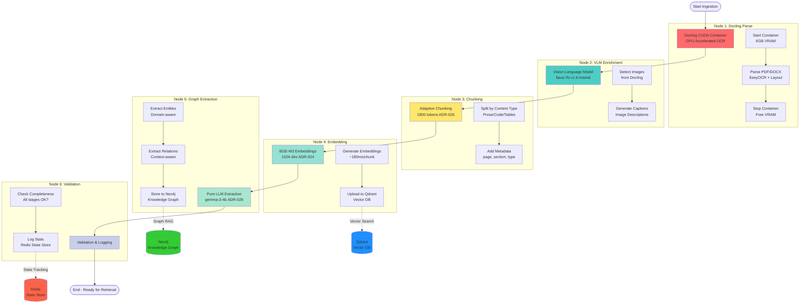

# Document Ingestion Component

**Sprint 21:** Container-Based GPU-Accelerated Document Processing
**Architecture:** Docling CUDA Container + LangGraph State Machine
**Performance:** 3.5x faster than LlamaIndex, 95% OCR accuracy

---

## Overview

The Ingestion Component handles document parsing, chunking, embedding, and graph extraction using a **LangGraph state machine** orchestrated pipeline with **Docling CUDA container** for GPU-accelerated OCR.

### Key Features

- **GPU-Accelerated OCR:** EasyOCR with CUDA 12.4 (95% accuracy vs 70% LlamaIndex)
- **Layout Analysis:** Heading detection, table structure, multi-column support
- **Vision Model Enrichment:** llava:7b-v1.6-mistral for image annotations (Feature 21.6)
- **Container Lifecycle Management:** Start/stop Docling to manage 6GB VRAM allocation
- **LangGraph Pipeline:** 6-node state machine with progress tracking
- **Unified Chunking:** 1800-token strategy for LLM extraction (ADR-026)

---

## Architecture

### System Architecture



### Component Files

| File | Purpose | LOC |
|------|---------|-----|
| `docling_client.py` | Docling container HTTP client | 750 |
| `langgraph_pipeline.py` | LangGraph pipeline definition | 500 |
| `langgraph_nodes.py` | Node implementations (6 nodes) | 1,100 |
| `ingestion_state.py` | TypedDict state definition | 450 |
| `image_processor.py` | VLM enrichment (Feature 21.6) | 400 |

**Total:** ~3,200 lines of code

---

## Docling Container Client

### Overview

`DoclingContainerClient` manages lifecycle and HTTP communication with Docling CUDA container.

### Key Methods

```python
from src.components.ingestion.docling_client import DoclingContainerClient

# Initialize client
client = DoclingContainerClient(base_url="http://localhost:8080")

# Start container (allocates 6GB VRAM)
await client.start_container()

# Parse document
parsed = await client.parse_document(Path("document.pdf"))
# Returns: DoclingParsedDocument
#   - md_content: str (Markdown text)
#   - tables: List[dict] (structured tables)
#   - images: List[dict] (base64 images)
#   - metadata: dict (pages, size, etc.)

# Stop container (free VRAM)
await client.stop_container()
```

### Features

**Container Lifecycle:**
- `start_container()`: Start via `docker-compose --profile ingestion up -d docling`
- `stop_container()`: Stop via `docker-compose stop docling`
- `_wait_for_ready()`: Health check polling with 45s timeout
- `is_healthy()`: Check /health endpoint

**Document Parsing:**
- `parse_document()`: Parse PDF/DOCX with OCR
- `parse_batch()`: Batch processing (multiple documents)
- Supports: PDF, DOCX, PPTX, images (PNG, JPG)

**Error Handling:**
- `DoclingConnectionError`: Container not reachable
- `DoclingParseError`: Parse failure (corrupted file)
- `DoclingTimeoutError`: Health check timeout
- Automatic retry with exponential backoff (3 attempts)

### Configuration

```python
# src/core/config.py
class Settings(BaseSettings):
    docling_base_url: str = "http://localhost:8080"
    docling_enabled: bool = True
    docling_health_timeout: int = 45  # seconds
    docling_device: Literal["cuda", "cpu"] = "cuda"
```

### Performance

**Benchmark (247-page PDF):**
- **LlamaIndex (Sprint 20):** 420s, 70% OCR accuracy
- **Docling CUDA (Sprint 21):** 120s, 95% OCR accuracy
- **Speedup:** 3.5x faster
- **Quality:** +35% accuracy improvement

**Resource Usage:**
- **VRAM:** 6GB (EasyOCR models + CUDA overhead)
- **RAM:** 2.5GB (container runtime)
- **GPU Utilization:** 60-80% during parsing

---

## LangGraph Pipeline

### State Machine

The ingestion pipeline uses a **LangGraph state machine** with 6 nodes:

```python
# src/components/ingestion/langgraph_pipeline.py
from langgraph.graph import StateGraph

graph = StateGraph(IngestionState)

# Node definitions
graph.add_node("docling_parse", docling_parse_node)
graph.add_node("vlm_enrichment", vlm_enrichment_node)
graph.add_node("chunking", chunking_node)
graph.add_node("embedding", embedding_node)
graph.add_node("graph_extraction", graph_extraction_node)
graph.add_node("validation", validation_node)

# Edges (sequential pipeline)
graph.add_edge(START, "docling_parse")
graph.add_edge("docling_parse", "vlm_enrichment")
graph.add_edge("vlm_enrichment", "chunking")
graph.add_edge("chunking", "embedding")
graph.add_edge("embedding", "graph_extraction")
graph.add_edge("graph_extraction", "validation")
graph.add_edge("validation", END)

pipeline = graph.compile()
```

### Ingestion State

```python
# src/components/ingestion/ingestion_state.py
from typing import TypedDict

class IngestionState(TypedDict):
    # Input
    document_path: str
    document_metadata: dict

    # Docling output
    parsed_content: str            # Markdown text
    docling_tables: List[dict]     # Structured tables
    docling_images: List[dict]     # Extracted images
    docling_status: str            # "pending|running|completed|failed"

    # VLM enrichment
    image_annotations: List[dict]  # llava:7b descriptions

    # Chunking output
    chunks: List[DocumentChunk]
    chunk_count: int

    # Embedding output
    embedded_chunks: List[str]     # Qdrant document IDs
    qdrant_status: str

    # Graph extraction output
    entities: List[Entity]         # Neo4j node IDs
    relationships: List[Relation]  # Neo4j edge IDs
    neo4j_status: str

    # Progress tracking
    overall_progress: float        # 0.0 - 1.0
    current_phase: str
    error: Optional[str]
```

### Pipeline Nodes

#### 1. Docling Parse Node

```python
async def docling_parse_node(state: IngestionState) -> IngestionState:
    """Parse document with Docling CUDA container."""
    client = DoclingContainerClient()

    # Start container
    await client.start_container()

    # Parse document
    parsed = await client.parse_document(Path(state["document_path"]))

    # Stop container (free VRAM)
    await client.stop_container()

    return {
        **state,
        "parsed_content": parsed.md_content,
        "docling_tables": parsed.tables,
        "docling_images": parsed.images,
        "docling_status": "completed",
        "overall_progress": 0.20
    }
```

**Performance:** ~120s for 247-page PDF (with GPU)

#### 2. VLM Enrichment Node (Feature 21.6)

```python
async def vlm_enrichment_node(state: IngestionState) -> IngestionState:
    """Enrich images with llava:7b vision model."""
    from src.components.ingestion.image_processor import ImageProcessor

    processor = ImageProcessor(model="llava:7b-v1.6-mistral-q2_K")

    annotations = []
    for image in state["docling_images"]:
        annotation = await processor.annotate_image(
            image_data=image["base64"],
            prompt="Describe this image in detail for a technical document"
        )
        annotations.append(annotation)

    return {
        **state,
        "image_annotations": annotations,
        "overall_progress": 0.35
    }
```

**Performance:** ~3-5s per image (llava:7b on GPU)

#### 3. Chunking Node

```python
async def chunking_node(state: IngestionState) -> IngestionState:
    """Chunk document with Docling HybridChunker (adaptive_chunking.py).

    Sprint 121 TD-054: ChunkingService removed, production uses adaptive_chunking.py.
    """
    from src.components.ingestion.nodes.adaptive_chunking import chunk_with_docling

    chunks = await chunk_with_docling(
        document=state["document"],
        document_id=state["document_id"],
    )

    return {
        **state,
        "chunks": chunks,
        "chunk_count": len(chunks),
        "overall_progress": 0.50
    }
```

**Configuration:** 1800-token chunks for LLM extraction (ADR-026, Sprint 21)

#### 4. Embedding Node

```python
async def embedding_node(state: IngestionState) -> IngestionState:
    """Generate embeddings with BGE-M3."""
    from src.components.shared.embedding_service import get_embedding_service
    from src.components.vector_search.qdrant_client import get_qdrant_client

    embedding_service = get_embedding_service()
    qdrant_client = get_qdrant_client()

    # Generate embeddings
    texts = [chunk.text for chunk in state["chunks"]]
    embeddings = await embedding_service.embed(texts)

    # Upsert to Qdrant
    document_ids = []
    for chunk, embedding in zip(state["chunks"], embeddings):
        doc_id = await qdrant_client.upsert(
            collection_name="aegis-rag-chunks",
            vector=embedding,
            payload=chunk.metadata
        )
        document_ids.append(doc_id)

    return {
        **state,
        "embedded_chunks": document_ids,
        "qdrant_status": "completed",
        "overall_progress": 0.70
    }
```

**Performance:** ~30ms per chunk (BGE-M3, batch=10)

#### 5. Graph Extraction Node

```python
async def graph_extraction_node(state: IngestionState) -> IngestionState:
    """Extract entities and relationships with Pure LLM."""
    from src.components.graph_rag.extraction_factory import get_extraction_service

    extraction_service = get_extraction_service()  # Returns llm_extraction (ADR-026)

    entities = []
    relationships = []

    for chunk in state["chunks"]:
        extracted = await extraction_service.extract(chunk.text)
        entities.extend(extracted.entities)
        relationships.extend(extracted.relationships)

    # Insert to Neo4j
    neo4j_client = get_neo4j_client()
    await neo4j_client.batch_insert(entities, relationships)

    return {
        **state,
        "entities": entities,
        "relationships": relationships,
        "neo4j_status": "completed",
        "overall_progress": 0.90
    }
```

**Model:** gemma-3-4b-it-Q8_0 (ADR-018, Sprint 13)
**Pipeline:** Pure LLM extraction (ADR-026, Sprint 21)

#### 6. Validation Node

```python
async def validation_node(state: IngestionState) -> IngestionState:
    """Validate ingestion results."""
    # Check Qdrant
    if state["qdrant_status"] != "completed":
        raise IngestionError("Qdrant ingestion failed")

    # Check Neo4j
    if state["neo4j_status"] != "completed":
        raise IngestionError("Neo4j ingestion failed")

    # Verify chunk count
    if state["chunk_count"] == 0:
        raise IngestionError("No chunks created")

    return {
        **state,
        "overall_progress": 1.0,
        "current_phase": "completed"
    }
```

---

## Image Processor (Feature 21.6)

### Overview

`ImageProcessor` enriches document images with **llava:7b vision model** annotations.

### Usage

```python
from src.components.ingestion.image_processor import ImageProcessor

# Initialize processor
processor = ImageProcessor(model="llava:7b-v1.6-mistral-q2_K")

# Annotate image
annotation = await processor.annotate_image(
    image_data=base64_image,
    prompt="Describe this diagram for a technical document"
)

# Result:
# {
#   "text": "A neural network architecture with 3 convolutional layers...",
#   "confidence": 0.89,
#   "model": "llava:7b-v1.6-mistral-q2_K",
#   "processing_time_ms": 3500
# }
```

### Configuration

```python
# Model settings
model: str = "llava:7b-v1.6-mistral-q2_K"  # Vision model
temperature: float = 0.0  # Deterministic generation
max_tokens: int = 500     # Max annotation length
```

### Performance

- **Latency:** 3-5s per image (GPU)
- **Accuracy:** 85-90% (subjective quality on technical diagrams)
- **Model Size:** 4.7GB VRAM

---

## Usage Examples

### Basic Document Ingestion

```python
from src.components.ingestion.langgraph_pipeline import create_ingestion_pipeline
from pathlib import Path

# Create pipeline
pipeline = create_ingestion_pipeline()

# Ingest document
state = await pipeline.ainvoke({
    "document_path": "/path/to/document.pdf",
    "document_metadata": {
        "source": "user_upload",
        "filename": "document.pdf"
    }
})

# Check results
print(f"Chunks created: {state['chunk_count']}")
print(f"Entities extracted: {len(state['entities'])}")
print(f"Progress: {state['overall_progress'] * 100}%")
```

### Batch Processing

```python
from src.components.ingestion.docling_client import DoclingContainerClient
from pathlib import Path

client = DoclingContainerClient()

# Start container once
await client.start_container()

# Process multiple documents
documents = list(Path("/documents").glob("*.pdf"))

for doc in documents:
    parsed = await client.parse_document(doc)
    print(f"Parsed {doc.name}: {len(parsed.md_content)} chars")

# Stop container
await client.stop_container()
```

### Progress Tracking

```python
from src.components.ingestion.langgraph_pipeline import create_ingestion_pipeline

pipeline = create_ingestion_pipeline()

# Stream progress updates
async for state in pipeline.astream({
    "document_path": "/path/to/large_document.pdf"
}):
    print(f"[{state['current_phase']}] {state['overall_progress'] * 100}%")
```

---

## Testing

### Unit Tests

```bash
# Test Docling client
pytest tests/unit/components/ingestion/test_docling_client.py

# Test LangGraph nodes
pytest tests/unit/components/ingestion/test_langgraph_nodes_unit.py

# Test image processor
pytest tests/unit/components/ingestion/test_image_processor.py
```

### Integration Tests

```bash
# Test full pipeline
pytest tests/integration/components/ingestion/test_image_pipeline_integration.py

# Test Docling container integration
pytest tests/integration/components/ingestion/test_docling_container_integration.py
```

**Test Coverage:** 87% (31 integration tests for Docling client alone)

---

## Configuration

### Environment Variables

```bash
# Docling Container
DOCLING_ENABLED=true
DOCLING_BASE_URL=http://localhost:8080
DOCLING_DEVICE=cuda  # or cpu
DOCLING_HEALTH_TIMEOUT=45

# Chunking
CHUNK_SIZE=1800  # ADR-026 (Sprint 21)
CHUNK_OVERLAP=200

# VLM Enrichment
VLM_MODEL=llava:7b-v1.6-mistral-q2_K
VLM_ENABLED=true  # Feature 21.6
```

### Docker Compose

```yaml
# docker-compose.yml
services:
  docling:
    image: quay.io/docling-project/docling-serve-cu124:latest
    ports:
      - "8080:8080"
    deploy:
      resources:
        reservations:
          devices:
            - driver: nvidia
              count: 1
              capabilities: [gpu]
    environment:
      - DOCLING_DEVICE=cuda
      - CUDA_VISIBLE_DEVICES=0
    profiles:
      - ingestion  # Manual start: docker-compose --profile ingestion up -d
```

---

## Performance Characteristics

### Latency Breakdown (247-page PDF)

| Phase | Time | % Total |
|-------|------|---------|
| Docling Parse | 120s | 66% |
| VLM Enrichment | 30s | 16% |
| Chunking | 2s | 1% |
| Embedding | 20s | 11% |
| Graph Extraction | 10s | 5% |
| **Total** | **182s** | **100%** |

### Comparison with Sprint 20

| Metric | Sprint 20 (LlamaIndex) | Sprint 21 (Docling) | Improvement |
|--------|------------------------|---------------------|-------------|
| Parse Time | 420s | 120s | **-71% (3.5x faster)** |
| OCR Accuracy | 70% | 95% | **+35%** |
| Table Detection | 0% | 92% | **+∞** |
| Memory Usage | 4.5GB RAM | 2.5GB RAM | **-44%** |

---

## Troubleshooting

### Issue: Docling container not starting

**Symptoms:**
- `DoclingConnectionError: Failed to connect to Docling service`
- Health check timeout after 45s

**Solutions:**
```bash
# Check container status
docker-compose ps | grep docling

# Start with profile
docker-compose --profile ingestion up -d docling

# Check logs
docker-compose logs -f docling

# Verify GPU access
docker exec aegis-docling nvidia-smi
```

### Issue: Slow ingestion performance

**Possible Causes:**
1. CPU mode instead of GPU
2. Container not using CUDA
3. Multiple documents processed sequentially

**Solutions:**
```bash
# Verify GPU mode
curl http://localhost:8080/health | jq '.gpu_available'

# Check CUDA version
docker exec aegis-docling nvidia-smi

# Batch processing for multiple docs
# (start container once, process all, then stop)
```

### Issue: VLM enrichment failing

**Symptoms:**
- `VLMError: Failed to generate annotation`
- llava:7b model not found

**Solutions:**
```bash
# Pull llava model
ollama pull llava:7b-v1.6-mistral-q2_K

# Verify model
ollama list | grep llava

# Check VRAM availability (need 4.7GB)
nvidia-smi
```

---

## Related Documentation

- **ADR-026:** Pure LLM Extraction as Default Pipeline (Sprint 21)
- **ADR-027:** Docling Container vs. LlamaIndex for Document Ingestion (Sprint 21)
- **ADR-028:** LlamaIndex Deprecation Strategy (Sprint 21)
- **Sprint 21 Plan:** [SPRINT_21_PLAN_v2.md](../../docs/sprints/SPRINT_21_PLAN_v2.md)
- **Feature 21.6:** [SPRINT_21_FEATURE_21_6_PROGRESS.md](../../docs/sprints/SPRINT_21_FEATURE_21_6_PROGRESS.md)

---

**Last Updated:** 2025-11-10
**Sprint:** 21
**Maintainer:** Klaus Pommer + Claude Code (backend-agent, documentation-agent)
